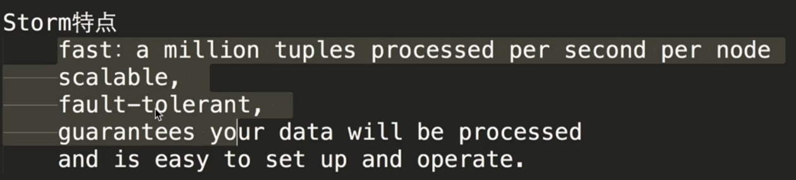
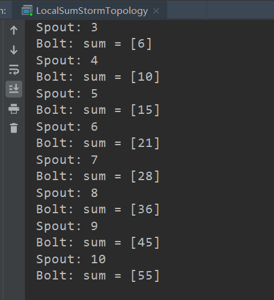
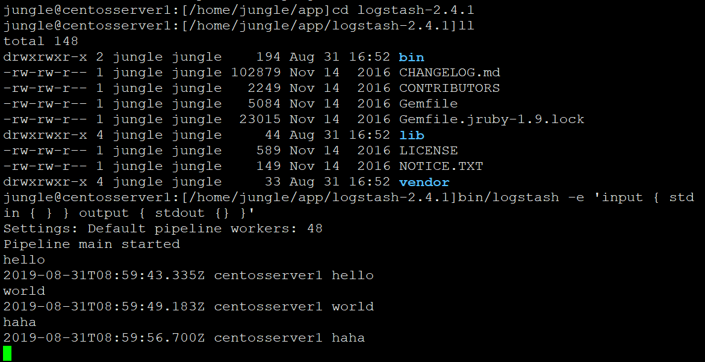
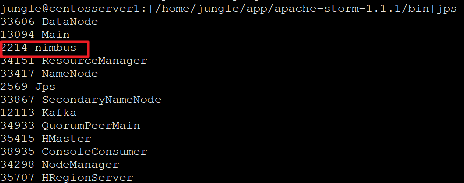
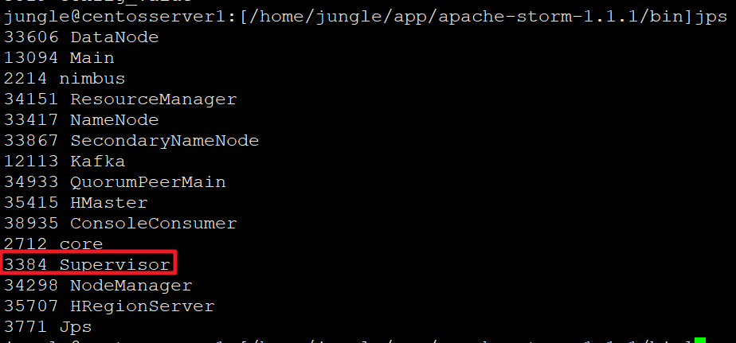
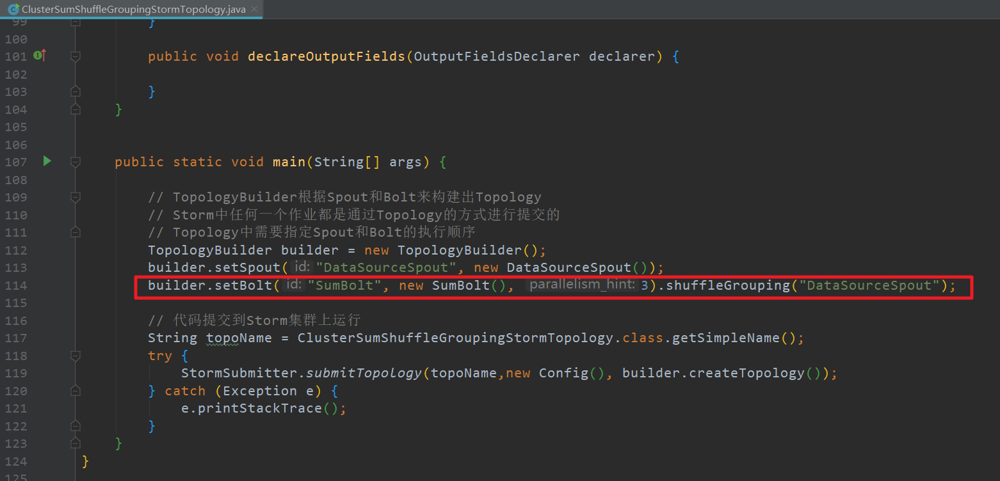
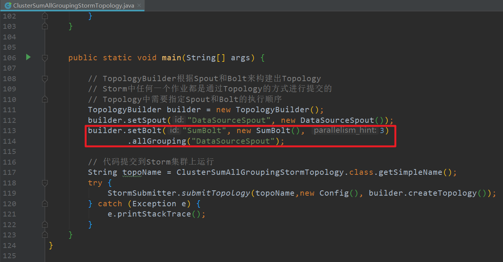
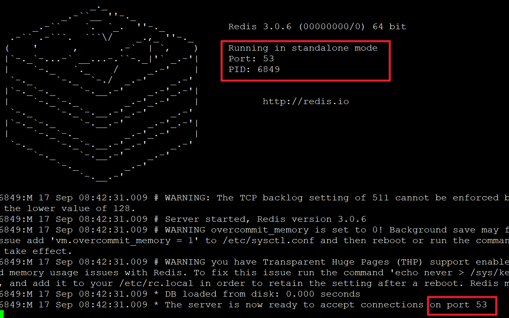
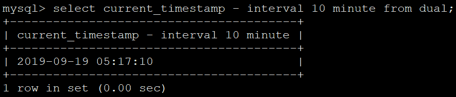

基于Storm构建实时热力分布项目实战

# 第2章 初识实时流处理Storm

## 一.是什么





## 二、历史


## 三、对比


## 四、发展趋势


# 第3章 Storm核心概念

## 一、初识Storm核心概念


## 二、Storm核心概念总结

```
Storm核心概念总结
	Topology： 计算拓扑，由spout和bolt组成的
	Stream：消息流，抽象概念，没有边界的tuple构成
	Tuple：消息/数据  传递的基本单元
	Spout：消息流的源头，Topology的消息生产者
	Bolt：消息处理单元，可以做过滤、聚合、查询/写数据库的操作
```


# 第4章 Storm编程

## 一、Storm开发环境搭建

### 1.环境

```
搭建开发环境
	jdk: 1.8
		windows: exe  
		linux/mac(dmg): tar .....   把jdk指定到系统环境变量(~/.bash_profile)
			export JAVA_HOME=/Library/Java/JavaVirtualMachines/jdk1.8.0_121.jdk/Contents/Home
			export PATH=$JAVA_HOME/bin:$PATH

			source ~/.bash_profile
			echo $JAVA_HOME
			java -version
	IDEA: 
	Maven: 3.3+
		windows/linux/mac 下载安装包
		tar .... -C ~/app

		把maven指定到系统环境变量(~/.bash_profile)
		export MAVEN_HOME=/Users/rocky/app/apache-maven-3.3.9
		export PATH=$MAVEN_HOME/bin:$PATH
		source ~/.bash_profile
		echo $JAVA_HOME
		mvn -v

		调整maven依赖下载的jar所在位置： $MAVEN_HOME/conf/setting.xml
		<localRepository>/Users/rocky/maven_repos</localRepository>

	在pom.xml中添加storm的maven依赖
		<dependency>
	      <groupId>org.apache.storm</groupId>
	      <artifactId>storm-core</artifactId>
	      <version>1.1.1</version>
	    </dependency>
```

### 2.创建项目


### 3.添加依赖

```xml
<dependency>
      <groupId>org.apache.storm</groupId>
      <artifactId>storm-core</artifactId>
      <version>1.1.1</version>
    </dependency>
```

## 二、Storm核心接口

### 1.ISpout详解

```
ISpout
	概述
		核心接口(interface)，负责将数据发送到topology中去处理
		Storm会跟踪Spout发出去的tuple的DAG
		ack/fail
		tuple: message id
		ack/fail/nextTuple是在同一个线程中执行的，所以不用考虑线程安全方面

	核心方法
		open： 初始化操作
		close： 资源释放操作
		nextTuple： 发送数据   core api
		ack： tuple处理成功，storm会反馈给spout一个成功消息
		fail：tuple处理失败，storm会发送一个消息给spout，处理失败

	实现类
		public abstract class BaseRichSpout extends BaseComponent implements IRichSpout {
		public interface IRichSpout extends ISpout, IComponent 
		DRPCSpout
		ShellSpout
```


### 2.IComponent详解

```
IComponent接口
	概述：
		public interface IComponent extends Serializable
		为topology中所有可能的组件提供公用的方法

		void declareOutputFields(OutputFieldsDeclarer declarer);
		用于声明当前Spout/Bolt发送的tuple的名称
		使用OutputFieldsDeclarer配合使用


	实现类：
	public abstract class BaseComponent implements IComponent
```


### 3.IBolt详解

```
IBolt接口
	概述
		职责：接收tuple处理，并进行相应的处理(filter/join/....)
		hold住tuple再处理
		IBolt会在一个运行的机器上创建，使用Java序列化它，然后提交到主节点(nimbus)上去执行
		nimbus会启动worker来反序列化，调用prepare方法，然后才开始处理tuple处理


	方法
		prepare：初始化
		execute：处理一个tuples数据，tuple对象中包含了元数据信息
		cleanup：shutdown之前的资源清理操作


	实现类：
		public abstract class BaseRichBolt extends BaseComponent implements IRichBolt {
		public interface IRichBolt extends IBolt, IComponent 
		RichShellBolt
```

## 三、Storm求和案例编程

```

求和案例
	需求：1 + 2 + 3 + ....   = ???
	实现方案：
		Spout发送数字作为input
		使用Bolt来处理业务逻辑：求和
		将结果输出到控制台
	拓扑设计： DataSourceSpout  --> SumBolt	
```


### 1.Spout功能实现

```java
/**
     * Spout需要继承BaseRichSpout
     * 数据源需要产生数据并发射
     */
    public static class DataSourceSpout extends BaseRichSpout {

        private SpoutOutputCollector collector;
        /**
         * 初始化方法，只会被调用一次
         * @param conf  配置参数
         * @param context  上下文
         * @param collector 数据发射器
         */
        public void open(Map conf, TopologyContext context, SpoutOutputCollector collector) {
            this.collector = collector;
        }

        int number = 0;

        /**
         * 会产生数据，在生产上肯定是从消息队列中获取数据
         *
         * 这个方法是一个死循环，会一直不停的执行
         */
        public void nextTuple() {
            this.collector.emit(new Values(++number));

            System.out.println("Spout: " + number);

            // 防止数据产生太快
            Utils.sleep(1000);

        }

        /**
         * 声明输出字段
         * @param declarer
         */
        public void declareOutputFields(OutputFieldsDeclarer declarer) {
            declarer.declare(new Fields("num"));
        }
    }

```


### 2.Bolt功能实现

```java
/**
     * 数据的累积求和Bolt：接收数据并处理
     */
    public static class SumBolt extends BaseRichBolt {

        /**
         * 初始化方法，会被执行一次
         * @param stormConf
         * @param context
         * @param collector
         */
        public void prepare(Map stormConf, TopologyContext context, OutputCollector collector) {

        }

        int sum = 0;

        /**
         * 其实也是一个死循环，职责：获取Spout发送过来的数据
         * @param input
         */
        public void execute(Tuple input) {

            // Bolt中获取值可以根据index获取，也可以根据上一个环节中定义的field的名称获取(建议使用该方式)
            Integer value = input.getIntegerByField("num");
            sum += value;

            System.out.println("Bolt: sum = [" + sum + "]");
        }

        public void declareOutputFields(OutputFieldsDeclarer declarer) {

        }
    }
```


### 3.Topology提交功能实现及测试

```java
 public static void main(String[] args) {

        // TopologyBuilder根据Spout和Bolt来构建出Topology
        // Storm中任何一个作业都是通过Topology的方式进行提交的
        // Topology中需要指定Spout和Bolt的执行顺序
        TopologyBuilder builder = new TopologyBuilder();
        builder.setSpout("DataSourceSpout", new DataSourceSpout());
        builder.setBolt("SumBolt", new SumBolt()).shuffleGrouping("DataSourceSpout");


        // 创建一个本地Storm集群：本地模式运行，不需要搭建Storm集群
        LocalCluster cluster = new LocalCluster();
        cluster.submitTopology("LocalSumStormTopology", new Config(),
                builder.createTopology());


    }
```

==运行==



## 四、Storm词频案例编程

```
词频统计
	需求：读取指定目录的数据，并实现单词计数功能
	实现方案：
		Spout来读取指定目录的数据，作为后续Bolt处理的input
		使用一个Bolt把input的数据，切割开，我们按照逗号进行分割
		使用一个Bolt来进行最终的单词的次数统计操作
		并输出
	拓扑设计： DataSourceSpout ==> SplitBolt ==> CountBolt	
```

### 1.Spout功能实现

+ 添加依赖

  ```xml
  <dependency>
        <groupId>commons-io</groupId>
        <artifactId>commons-io</artifactId>
        <version>2.4</version>
      </dependency>
  ```

+ 程序

  ```java
   public static class DataSourceSpout extends BaseRichSpout {
          private SpoutOutputCollector collector;
  
          public void open(Map conf, TopologyContext context, SpoutOutputCollector collector) {
              this.collector = collector;
          }
  
          /**
           * 业务：
           * 1） 读取指定目录的文件夹下的数据:E:\data\wc
           * 2） 把每一行数据发射出去
           */
          public void nextTuple() {
  
              // 获取所有文件
              Collection<File> files = FileUtils.listFiles(new File("E:\\data\\wc"),
                      new String[]{"txt"},true);
  
              for(File file : files) {
                  try {
                      // 获取文件中的所有内容
                      List<String> lines = FileUtils.readLines(file);
  
                      // 获取文件中的每行的内容
                      for(String line : lines) {
  
                          // 发射出去
                          this.collector.emit(new Values(line));
                      }
  
                      // TODO... 数据处理完之后，改名，否则一直重复执行
                      //路径+时间戳
                      FileUtils.moveFile(file, new File(file.getAbsolutePath() + System.currentTimeMillis()));
                  } catch (IOException e) {
                      e.printStackTrace();
                  }
              }
  
          }
       
          /**
           * 声明输出字段
           * 为输出的字段定义一个名字
           * @param declarer
           */
          public void declareOutputFields(OutputFieldsDeclarer declarer) {
              declarer.declare(new Fields("line"));
          }
      }
  
  ```

  

### 2.Bolt功能实现

```java
 /**
     * 对数据进行分割
     */
    public static class SplitBolt extends BaseRichBolt {

        //定义一个发射器，可以继续向下发射数据
        private OutputCollector collector;

        public void prepare(Map stormConf, TopologyContext context, OutputCollector collector) {
            this.collector = collector;
        }

        /**
         * 业务逻辑：
         *   line： 对line进行分割，按照逗号
         */
        public void execute(Tuple input) {
            String line = input.getStringByField("line");
            String[] words = line.split(",");

            //将单词发射出去
            for(String word : words) {
                this.collector.emit(new Values(word));
            }

        }

        /**
         * 为数据定义一个名字
         * @param declarer
         */
        public void declareOutputFields(OutputFieldsDeclarer declarer) {
            declarer.declare(new Fields("word"));
        }
    }


    /**
     * 词频汇总Bolt
     */
    public static class CountBolt extends  BaseRichBolt {

        //不需要向下发射了，所以不需要定义collector
        public void prepare(Map stormConf, TopologyContext context, OutputCollector collector) {

        }


        Map<String,Integer> map = new HashMap<String, Integer>();
        /**
         * 业务逻辑：
         * 1）获取每个单词
         * 2）对所有单词进行汇总
         * 3）输出
         */
        public void execute(Tuple input) {
            // 1）获取每个单词
            String word = input.getStringByField("word");
            Integer count = map.get(word);
            if(count == null) {
                count = 0;
            }

            count ++;

            // 2）对所有单词进行汇总
            map.put(word, count);

            // 3）输出
            System.out.println("~~~~~~~~~~~~~~~~~~~~~~");
            Set<Map.Entry<String,Integer>> entrySet = map.entrySet();
            for(Map.Entry<String,Integer> entry : entrySet) {
                System.out.println(entry);
            }

        }

        public void declareOutputFields(OutputFieldsDeclarer declarer) {

        }
    }

```


### 3.Topology提交功能实现及测试

```java
public static void main(String[] args) {

        // 通过TopologyBuilder根据Spout和Bolt构建Topology
        TopologyBuilder builder = new TopologyBuilder();
        builder.setSpout("DataSourceSpout", new DataSourceSpout());
        //设置关联关系
        builder.setBolt("SplitBolt", new SplitBolt()).shuffleGrouping("DataSourceSpout");
        builder.setBolt("CountBolt", new CountBolt()).shuffleGrouping("SplitBolt");

        // 创建本地集群
        LocalCluster cluster = new LocalCluster();
        cluster.submitTopology("LocalWordCountStormTopology",
                new Config(), builder.createTopology());

    }
```

### 4.创建测试用例

+ test.txt

  ```
  a,d,e,a,s,w,e,q,a,s,
  q,s,e,r,s,a,	q,e,r,w,q
  e,x,a,w,s
  ```

==运行==


## 五、Storm编程注意事项

```
Storm编程注意事项
1) Exception in thread "main" java.lang.IllegalArgumentException: Spout has already been declared for id DataSourceSpout
2) org.apache.storm.generated.InvalidTopologyException: null
3) topology的名称不是重复： local似乎没问题， 等我们到集群测试的时候再来验证这个问题
```

# 第5章 Storm周边框架使用

## 一、JDK安装

```
环境前置说明：
	通过我们的客户端(终端，CRT，XShell)
	ssh hadoop@hadoop000
	ssh hadoop@192.168.199.102

	远程服务器的用户名是hadoop，密码也是hadoop
	有没有提供root权限，sudo command

	hadoop000(192.168.199.102)是远程服务器的hostname

	如果你想在本地通过ssh hadoop@hadoop000远程登录，
	那么你本地的hosts肯定要添加ip和hostname的映射

	192.168.199.102  hadoop000

JDK的安装
	将所有的软件都安装到~/app
		tar -zxvf jdk-8u91-linux-x64.tar.gz -C ~/app/

	建议将jdk的bin目录配置到系统环境变量中： ~/.bash_profile
		export JAVA_HOME=/home/hadoop/app/jdk1.8.0_91
		export PATH=$JAVA_HOME/bin:$PATH

	让系统环境变量生效
		source ~/.bash_profile

	验证
		java -version
```

## 二、ZooKeeper概述及环境搭建

```
ZooKeeper安装
	下载ZK的安装包：http://archive.cloudera.com/cdh5/cdh/5/
	解压：tar -zxvf zookeeper-3.4.5-cdh5.7.0.tar.gz -C ~/app/
	建议ZK_HOME/bin添加到系统环境变量: ~/.bash_profile
		export ZK_HOME=/home/hadoop/app/zookeeper-3.4.5-cdh5.7.0
		export PATH=$ZK_HOME/bin:$PATH
	让系统环境变量生效
		source ~/.bash_profile
	修改ZK的配置： $ZK_HOME/conf/zoo.cfg
		dataDir=/home/hadoop/app/tmp/zookeeper
	启动zk: $ZK_HOME/bin/
		zkServer.sh start
	验证: jps
		多了一个QuorumPeerMain进程，就表示zk启动成功了
```

```
jps -l
```

## 三、Logstash概述及部署

[ELK](www.elastic.co)

[下载](https://www.elastic.co/cn/downloads/logstash)

​	


+ 解压

  ```
  tar -zxvf logstash-2.4.1.tar.gz -C ~/app
  ```

## 四、Logstash使用

### 1.控制台输入输出

```
cd logstash-2.4.1
```

```
bin/logstash -e 'input { stdin { } } output { stdout {} }'
```



==json字符串输出==

```
bin/logstash -e 'input { stdin { } } output { stdout {codec => json} }'
```


+ 使用配置文件

  ```
  vi test.conf
  ```

  ```
   input {       
        stdin {}  
       }         
                   
   output {      
       stdout {}                                                                 
       }   
  ```

  

  ```
  bin/logstash -f test.conf
  ```

  

### 2.文件输入控制台输出

​		--监控文件

```
touch logstash.txt
```

​	--配置文件

```
vi file_stdout.conf
```

```
input {               
     file {            
         path => "/home/jungle/app/logstash-2.4.1/logstash.txt"
         }             
     }                 
                       
 output {              
     stdout {          
         codec => json                                                         
         }             
                       
     }        
```


==启动==

```
bin/logstash -f file_stdout.conf 
```

==测试==


## 五、Kafka概述


## 六、Kafka架构及核心概念


## 七、Logstash使用之整合Kafka

1. 启动zookeeper

2. 启动Kafka

   ```
   cd $KAFKA_HOME/bin
   kafka-server-start.sh -daemon $KAFKA_HOME/config/server.properties 
   ```

   

3. 创建topic

   ```
   kafka-topics.sh --create --zookeeper centosserver1:2181 --replication-factor 1 --partitions 1 --topic logstash_topic 
   ```

   

4. logstash配置文件

   ```
   vi file_kafka.conf
   ```

   ```
   input {              
       file {           
           path => "/home/jungle/app/logstash-2.4.1/logstash.txt"
           }            
       }                
                        
   output {             
       kafka {          
           topic_id => "logstash_topic"             
           bootstrap_servers => "centosserver1:9092"
           batch_size => 1                                                         
           }            
       }     
   ```

   

   ==启动==

   ```
   bin/logstash -f file_kafka.conf 
   ```

   ==测试==

   Kafka消费端

   ```
   kafka-console-consumer.sh --zookeeper centosserver1:2181 --topic logstash_topic 
   ```

   

   

# 第6章 Storm架构及部署

## 一、Storm架构详解


```
Storm架构
	类似于Hadoop的架构，主从(Master/Slave)
	Nimbus: 主
		集群的主节点，负责任务(task)的指派和分发、资源的分配
	Supervisor: 从
		可以启动多个Worker，具体几个呢？可以通过配置来指定
		一个Topo可以运行在多个Worker之上，也可以通过配置来指定
		集群的从节点，(负责干活的)，负责执行任务的具体部分
		启动和停止自己管理的Worker进程
	无状态，在他们上面的信息(元数据)会存储在ZK中
	Worker: 运行具体组件逻辑(Spout/Bolt)的进程
	=====================分割线===================
	task： 
		Spout和Bolt
		Worker中每一个Spout和Bolt的线程称为一个Task
	executor： spout和bolt可能会共享一个线程
```


## 二、Storm单机部署之前置条件及解压

```
Storm部署的前置条件
	jdk7+
	python2.6.6+

我们课程使用的Storm版本是：1.1.1
```

[下载](https://archive.apache.org/dist/storm/)


+ 解压

  ```
  tar -zxvf apache-storm-1.1.1.tar.gz -C ~/app/
  ```

+ 配置环境变量

  ```
  vi ~/.bash_profile
  ```

  ```
  export STORM_HOME=/home/jungle/app/apache-storm-1.1.1
  export PATH=$STORM_HOME/bin:$PATH  
  ```

  

  ```
  source ~/.bash_profile
  ```

## 三、Storm单机部署之启动Storm各节点及Storm UI界面详解

### 1.配置

  ```
  cd $STORM_HOME/conf/
  vi storm-env.sh
  ```

  ```
  export JAVA_HOME=/home/jungle/app/jdk1.8.0_152 
  ```

  

### 2.启动


```
Storm启动
	$STORM_HOME/bin/storm   如何使用  执行storm就能看到很多详细的命令
		dev-zookeeper  启动zk
			storm dev-zookeeper  前台启动
			nohup sh storm dev-zookeeper &
			jps ： dev_zookeeper
		nimbus  启动主节点
			nohup sh storm nimbus &
		supervisor 启动从节点
			nohup sh storm supervisor &
		ui  启动UI界面
			nohup sh storm ui &
		logviewer 启动日志查看服务
			nohup sh storm logviewer &
```

==具体启动过程==

1. zookeeper

```
# 启动内置的zookeeper，默认端口2181
storm dev-zookeeper
```

2. nimbus

   ```
   nohup sh storm nimbus &
   ```



3. ui

   ```
   nohup sh storm ui &
   ```

   

   ```
   # ui访问
   http://192.168.1.18:8080
   ```

   

4. supervisor

   ```
   nohup sh storm supervisor &
   ```

   

5. logviewer

   ```
   nohup sh storm logviewer &
   ```

   

## 四、改写Storm作业并提交到Storm单节点集群运行

+ 代码

  ```java
  package com.jungle.bigdata;
  
  import org.apache.storm.Config;
  import org.apache.storm.LocalCluster;
  import org.apache.storm.StormSubmitter;
  import org.apache.storm.generated.AlreadyAliveException;
  import org.apache.storm.generated.AuthorizationException;
  import org.apache.storm.generated.InvalidTopologyException;
  import org.apache.storm.spout.SpoutOutputCollector;
  import org.apache.storm.task.OutputCollector;
  import org.apache.storm.task.TopologyContext;
  import org.apache.storm.topology.OutputFieldsDeclarer;
  import org.apache.storm.topology.TopologyBuilder;
  import org.apache.storm.topology.base.BaseRichBolt;
  import org.apache.storm.topology.base.BaseRichSpout;
  import org.apache.storm.tuple.Fields;
  import org.apache.storm.tuple.Tuple;
  import org.apache.storm.tuple.Values;
  import org.apache.storm.utils.Utils;
  
  import java.util.Map;
  
  /**
   * 使用Storm实现积累求和的操作
   */
  public class ClusterSumStormTopology {
  
  
      /**
       * Spout需要继承BaseRichSpout
       * 数据源需要产生数据并发射
       */
      public static class DataSourceSpout extends BaseRichSpout {
  
          private SpoutOutputCollector collector;
          /**
           * 初始化方法，只会被调用一次
           * @param conf  配置参数
           * @param context  上下文
           * @param collector 数据发射器
           */
          public void open(Map conf, TopologyContext context, SpoutOutputCollector collector) {
              this.collector = collector;
          }
  
          int number = 0;
  
          /**
           * 会产生数据，在生产上肯定是从消息队列中获取数据
           *
           * 这个方法是一个死循环，会一直不停的执行
           */
          public void nextTuple() {
              this.collector.emit(new Values(++number));
  
              System.out.println("Spout: " + number);
  
              // 防止数据产生太快
              Utils.sleep(1000);
  
          }
  
          /**
           * 声明输出字段
           * @param declarer
           */
          public void declareOutputFields(OutputFieldsDeclarer declarer) {
              declarer.declare(new Fields("num"));
          }
      }
  
  
      /**
       * 数据的累积求和Bolt：接收数据并处理
       */
      public static class SumBolt extends BaseRichBolt {
  
          /**
           * 初始化方法，会被执行一次
           * @param stormConf
           * @param context
           * @param collector
           */
          public void prepare(Map stormConf, TopologyContext context, OutputCollector collector) {
  
          }
  
          int sum = 0;
  
          /**
           * 其实也是一个死循环，职责：获取Spout发送过来的数据
           * @param input
           */
          public void execute(Tuple input) {
  
              // Bolt中获取值可以根据index获取，也可以根据上一个环节中定义的field的名称获取(建议使用该方式)
              Integer value = input.getIntegerByField("num");
              sum += value;
  
              System.out.println("Bolt: sum = [" + sum + "]");
          }
  
          public void declareOutputFields(OutputFieldsDeclarer declarer) {
  
          }
      }
  
  
      public static void main(String[] args) {
  
          // TopologyBuilder根据Spout和Bolt来构建出Topology
          // Storm中任何一个作业都是通过Topology的方式进行提交的
          // Topology中需要指定Spout和Bolt的执行顺序
          TopologyBuilder builder = new TopologyBuilder();
          builder.setSpout("DataSourceSpout", new DataSourceSpout());
          builder.setBolt("SumBolt", new SumBolt()).shuffleGrouping("DataSourceSpout");
  
          // 代码提交到Storm集群上运行
          String topoName = ClusterSumStormTopology.class.getSimpleName();
          try {
              StormSubmitter.submitTopology(topoName,new Config(), builder.createTopology());
          } catch (Exception e) {
              e.printStackTrace();
          }
      }
  }
  
  ```

  

+ 打包

  下面是全打包，不建议这样

  ```xml
    <plugin>
      <artifactId>maven-assembly-plugin</artifactId>
      <configuration>
        <descriptorRefs>  
          <descriptorRef>jar-with-dependencies</descriptorRef>
        </descriptorRefs>
        <archive>
          <manifest>
            <mainClass>com.path.to.main.Class</mainClass>
          </manifest>
        </archive>
      </configuration>
    </plugin>
  ```

  ```
   mvn assembly:assembly
  ```

  ==建议使用==

  ```
  mvn clean package -DskipTests
  ```

  

  + 运行

    [命令查看](http://storm.apache.org/releases/2.0.0/Command-line-client.html)

  ```
  Storm如何运行我们自己开发的应用程序呢?
  	Syntax: storm jar topology-jar-path class args0 args1 args2
  ```

  ```
  storm jar /home/jungle/lib/storm-1.0.0-SNAPSHOT.jar com.jungle.bigdata.ClusterSumStormTopology
  ```

  

  ==总结==

  ```
  如何修改将跑在本地的storm app改成运行在集群上的
  StormSubmitter.submitTopology(topoName,new Config(), builder.createTopology());
  ```

  

## 五、Storm常用命令介绍

```
storm 其他命令的使用
	list
		Syntax: storm list
		List the running topologies and their statuses.

	如何停止作业
		kill
			Syntax: storm kill topology-name [-w wait-time-secs]

	如何停止集群
		hadoop： stop-all.sh
		kill -9 pid,pid....

```

1. 查看运行列表

```
storm list
```


2. 停止任务

   

   

## 六、Storm集群部署规划

```
Storm集群的部署规划
	hadoop000   192.168.199.102
	hadoop001   192.168.199.247
	hadoop002   192.168.199.138 

	每台机器的host映射：/etc/hosts
		192.168.199.102 hadoop000
		192.168.199.247 hadoop001
		192.168.199.138 hadoop002


	hadoop000: zk nimbus  supervisor
	hadoop001: zk 		  supervisor
	hadoop002: zk         supervisor
```

## 七、Storm集群部署

### 1.软件包分发和jdk部署

```

安装包的分发: 从hadoop000机器做为出发点
	scp  xxxx  hadoop@hadoop001:~/software
	scp  xxxx  hadoop@hadoop002:~/software

jdk的安装
	解压
	配置到系统环境变量
	验证
```


### 2.ZooKeeper分布式环境部署

```
ZK分布式环境的安装
server.1=hadoop000:2888:3888
server.2=hadoop001:2888:3888
server.3=hadoop002:2888:3888
```

1. 每台服务器

```
vi zoo.cfg
```


```
hadoop000的dataDir目录: myid的值1
hadoop001的dataDir目录: myid的值2
hadoop002的dataDir目录: myid的值3
```

2. 每台服务器

   ==dataDir目录下==

```
vi mid
```

```
1
```

```
vi mid
```

```
2
```

```
vi mid
```

```
3
```

3. 每台服务器配置环境变量

4. 每台服务器启动

   ```
   ./zkServer.sh start
   ```

5. 检查状态

   ```
   zkServer.sh status
   ```

   

   

### 3.Storm集群部署及启动

+ storm集群

  ```
  Storm集群
  	$STORM_HOME/conf/storm.yaml
  		storm.zookeeper.servers:
  		     - "hadoop000"
  		     - "hadoop001"
  		     - "hadoop002"
  
  		storm.local.dir: "/home/hadoop/app/tmp/storm"
  
  		supervisor.slots.ports:
  		     - 6700
  		     - 6701
  		     - 6702
  		     - 6703
  
  启动
  	hadoop000: nimbus  supervisor(ui,logviewer)
  	hadoop001: supervisor(logviewer)
  	hadoop002: supervisor(logviewer)
  
  nimbus  启动主节点
  	nohup sh storm nimbus &
  supervisor 启动从节点
  	nohup sh storm supervisor &
  ui  启动UI界面
  	nohup sh storm ui &
  logviewer 启动日志查看服务
  	nohup sh storm logviewer &
  
  
  启动完所有的进程之后，查看
  [hadoop@hadoop000 bin]$ jps
  7424 QuorumPeerMain
  8164 Supervisor
  7769 nimbus
  8380 logviewer
  7949 core
  
  [hadoop@hadoop001 bin]$ jps
  3142 logviewer
  2760 QuorumPeerMain
  2971 Supervisor
  
  [hadoop@hadoop002 bin]$ jps
  3106 logviewer
  2925 Supervisor
  2719 QuorumPeerMain
  
  ```

  1. storm-env.sh

     

  2. storm.yaml

  ```
  vi storm.yaml
  ```

  

  3. 启动

  ```
  启动
  	hadoop000: nimbus  supervisor(ui,logviewer)
  	hadoop001: supervisor(logviewer)
  	hadoop002: supervisor(logviewer)
  
  nimbus  启动主节点
  	nohup sh storm nimbus &
  supervisor 启动从节点
  	nohup sh storm supervisor &
  ui  启动UI界面
  	nohup sh storm ui &
  logviewer 启动日志查看服务
  	nohup sh storm logviewer &
  ```

  

### 4.提交Storm作业到集群中运行&目录树介绍

```
cd /home/jungle/tmp/storm
tree
```


```
storm jar /home/hadoop/lib/storm-1.0.jar com.imooc.bigdata.ClusterSumStormTopology

目录树
	storm.local.dir
		nimbus/inbox:stormjar-....jar
		supervisor/stormdist
			ClusterSumStormTopology-1-1511599690
			│   │       ├── stormcode.ser
			│   │       ├── stormconf.ser
			│   │       └── stormjar.jar

```

---

# 第7章 并行度

## 一、并行度概念详解


```
并行度
	一个worker进程执行的是一个topo的子集
	一个worker进程会启动1..n个executor线程来执行一个topo的component
	一个运行的topo就是由集群中多台物理机上的多个worker进程组成

	executor是一个被worker进程启动的单独线程，每个executor只会运行1个topo的一个component
	task是最终运行spout或者bolt代码的最小执行单元

	默认：
		一个supervisor节点最多启动4个worker进程  ?
		每一个topo默认占用一个worker进程         ?
		每个worker进程会启动一个executor        ?
		每个executor启动一个task                ?

```


## 二、Storm作业运行UI页面上的参数详解


```
Total slots:4  
Executors: 3 ????  spout + bolt = 2  why 3?
	acker 导致的
```

## 三、worker数量的设置


```java
package com.jungle.bigdata;

import org.apache.storm.Config;
import org.apache.storm.StormSubmitter;
import org.apache.storm.spout.SpoutOutputCollector;
import org.apache.storm.task.OutputCollector;
import org.apache.storm.task.TopologyContext;
import org.apache.storm.topology.OutputFieldsDeclarer;
import org.apache.storm.topology.TopologyBuilder;
import org.apache.storm.topology.base.BaseRichBolt;
import org.apache.storm.topology.base.BaseRichSpout;
import org.apache.storm.tuple.Fields;
import org.apache.storm.tuple.Tuple;
import org.apache.storm.tuple.Values;
import org.apache.storm.utils.Utils;

import java.util.Map;

/**
 * 使用Storm实现积累求和的操作
 */
public class ClusterSumStormWorkersTopology {


    /**
     * Spout需要继承BaseRichSpout
     * 数据源需要产生数据并发射
     */
    public static class DataSourceSpout extends BaseRichSpout {

        private SpoutOutputCollector collector;
        /**
         * 初始化方法，只会被调用一次
         * @param conf  配置参数
         * @param context  上下文
         * @param collector 数据发射器
         */
        public void open(Map conf, TopologyContext context, SpoutOutputCollector collector) {
            this.collector = collector;
        }

        int number = 0;

        /**
         * 会产生数据，在生产上肯定是从消息队列中获取数据
         *
         * 这个方法是一个死循环，会一直不停的执行
         */
        public void nextTuple() {
            this.collector.emit(new Values(++number));

            System.out.println("Spout: " + number);

            // 防止数据产生太快
            Utils.sleep(1000);

        }

        /**
         * 声明输出字段
         * @param declarer
         */
        public void declareOutputFields(OutputFieldsDeclarer declarer) {
            declarer.declare(new Fields("num"));
        }
    }


    /**
     * 数据的累积求和Bolt：接收数据并处理
     */
    public static class SumBolt extends BaseRichBolt {

        /**
         * 初始化方法，会被执行一次
         * @param stormConf
         * @param context
         * @param collector
         */
        public void prepare(Map stormConf, TopologyContext context, OutputCollector collector) {

        }

        int sum = 0;

        /**
         * 其实也是一个死循环，职责：获取Spout发送过来的数据
         * @param input
         */
        public void execute(Tuple input) {

            // Bolt中获取值可以根据index获取，也可以根据上一个环节中定义的field的名称获取(建议使用该方式)
            Integer value = input.getIntegerByField("num");
            sum += value;

            System.out.println("Bolt: sum = [" + sum + "]");
        }

        public void declareOutputFields(OutputFieldsDeclarer declarer) {

        }
    }


    public static void main(String[] args) {

        // TopologyBuilder根据Spout和Bolt来构建出Topology
        // Storm中任何一个作业都是通过Topology的方式进行提交的
        // Topology中需要指定Spout和Bolt的执行顺序
        TopologyBuilder builder = new TopologyBuilder();
        builder.setSpout("DataSourceSpout", new DataSourceSpout());
        builder.setBolt("SumBolt", new SumBolt()).shuffleGrouping("DataSourceSpout");

        // 代码提交到Storm集群上运行
        String topoName = ClusterSumStormWorkersTopology.class.getSimpleName();
        try {
            Config config = new Config();
            config.setNumWorkers(2);
            config.setNumAckers(0);
            StormSubmitter.submitTopology(topoName,config, builder.createTopology());
        } catch (Exception e) {
            e.printStackTrace();
        }
    }
}

```

+ 打包

```
mvn clean package -DskipTests
```

+ 运行

  ```
  storm jar /home/jungle/lib/storm-1.0.0-SNAPSHOT.jar com.jungle.bigdata.ClusterSumStormWorkersTopology
  ```


```
jps
```


## 四、executor数量的设置

```java
package com.jungle.bigdata;

import org.apache.storm.Config;
import org.apache.storm.StormSubmitter;
import org.apache.storm.spout.SpoutOutputCollector;
import org.apache.storm.task.OutputCollector;
import org.apache.storm.task.TopologyContext;
import org.apache.storm.topology.OutputFieldsDeclarer;
import org.apache.storm.topology.TopologyBuilder;
import org.apache.storm.topology.base.BaseRichBolt;
import org.apache.storm.topology.base.BaseRichSpout;
import org.apache.storm.tuple.Fields;
import org.apache.storm.tuple.Tuple;
import org.apache.storm.tuple.Values;
import org.apache.storm.utils.Utils;

import java.util.Map;

/**
 * 使用Storm实现积累求和的操作
 */
public class ClusterSumStormExecutorsTopology {


    /**
     * Spout需要继承BaseRichSpout
     * 数据源需要产生数据并发射
     */
    public static class DataSourceSpout extends BaseRichSpout {

        private SpoutOutputCollector collector;
        /**
         * 初始化方法，只会被调用一次
         * @param conf  配置参数
         * @param context  上下文
         * @param collector 数据发射器
         */
        public void open(Map conf, TopologyContext context, SpoutOutputCollector collector) {
            this.collector = collector;
        }

        int number = 0;

        /**
         * 会产生数据，在生产上肯定是从消息队列中获取数据
         *
         * 这个方法是一个死循环，会一直不停的执行
         */
        public void nextTuple() {
            this.collector.emit(new Values(++number));

            System.out.println("Spout: " + number);

            // 防止数据产生太快
            Utils.sleep(1000);

        }

        /**
         * 声明输出字段
         * @param declarer
         */
        public void declareOutputFields(OutputFieldsDeclarer declarer) {
            declarer.declare(new Fields("num"));
        }
    }


    /**
     * 数据的累积求和Bolt：接收数据并处理
     */
    public static class SumBolt extends BaseRichBolt {

        /**
         * 初始化方法，会被执行一次
         * @param stormConf
         * @param context
         * @param collector
         */
        public void prepare(Map stormConf, TopologyContext context, OutputCollector collector) {

        }

        int sum = 0;

        /**
         * 其实也是一个死循环，职责：获取Spout发送过来的数据
         * @param input
         */
        public void execute(Tuple input) {

            // Bolt中获取值可以根据index获取，也可以根据上一个环节中定义的field的名称获取(建议使用该方式)
            Integer value = input.getIntegerByField("num");
            sum += value;

            System.out.println("Bolt: sum = [" + sum + "]");
        }

        public void declareOutputFields(OutputFieldsDeclarer declarer) {

        }
    }


    public static void main(String[] args) {

        // TopologyBuilder根据Spout和Bolt来构建出Topology
        // Storm中任何一个作业都是通过Topology的方式进行提交的
        // Topology中需要指定Spout和Bolt的执行顺序
        TopologyBuilder builder = new TopologyBuilder();
        builder.setSpout("DataSourceSpout", new DataSourceSpout(), 2);
        builder.setBolt("SumBolt", new SumBolt(), 2).shuffleGrouping("DataSourceSpout");

        // 代码提交到Storm集群上运行
        String topoName = ClusterSumStormExecutorsTopology.class.getSimpleName();
        try {
            Config config = new Config();
            config.setNumWorkers(2);
            config.setNumAckers(0);
            StormSubmitter.submitTopology(topoName,config, builder.createTopology());
        } catch (Exception e) {
            e.printStackTrace();
        }
    }
}

```


+ 打包

  ```
  mvn clean package -DskipTests
  ```

+ 运行

  ```
  storm jar /home/jungle/lib/storm-1.0.0-SNAPSHOT.jar com.jungle.bigdata.ClusterSumStormExecutorsTopology
  ```
  
  

## 五、task数量的设置

```java
package com.jungle.bigdata;

import org.apache.storm.Config;
import org.apache.storm.StormSubmitter;
import org.apache.storm.spout.SpoutOutputCollector;
import org.apache.storm.task.OutputCollector;
import org.apache.storm.task.TopologyContext;
import org.apache.storm.topology.OutputFieldsDeclarer;
import org.apache.storm.topology.TopologyBuilder;
import org.apache.storm.topology.base.BaseRichBolt;
import org.apache.storm.topology.base.BaseRichSpout;
import org.apache.storm.tuple.Fields;
import org.apache.storm.tuple.Tuple;
import org.apache.storm.tuple.Values;
import org.apache.storm.utils.Utils;

import java.util.Map;

/**
 * 使用Storm实现积累求和的操作
 */
public class ClusterSumStormTasksTopology {


    /**
     * Spout需要继承BaseRichSpout
     * 数据源需要产生数据并发射
     */
    public static class DataSourceSpout extends BaseRichSpout {

        private SpoutOutputCollector collector;
        /**
         * 初始化方法，只会被调用一次
         * @param conf  配置参数
         * @param context  上下文
         * @param collector 数据发射器
         */
        public void open(Map conf, TopologyContext context, SpoutOutputCollector collector) {
            this.collector = collector;
        }

        int number = 0;

        /**
         * 会产生数据，在生产上肯定是从消息队列中获取数据
         *
         * 这个方法是一个死循环，会一直不停的执行
         */
        public void nextTuple() {
            this.collector.emit(new Values(++number));

            System.out.println("Spout: " + number);

            // 防止数据产生太快
            Utils.sleep(1000);

        }

        /**
         * 声明输出字段
         * @param declarer
         */
        public void declareOutputFields(OutputFieldsDeclarer declarer) {
            declarer.declare(new Fields("num"));
        }
    }


    /**
     * 数据的累积求和Bolt：接收数据并处理
     */
    public static class SumBolt extends BaseRichBolt {

        /**
         * 初始化方法，会被执行一次
         * @param stormConf
         * @param context
         * @param collector
         */
        public void prepare(Map stormConf, TopologyContext context, OutputCollector collector) {

        }

        int sum = 0;

        /**
         * 其实也是一个死循环，职责：获取Spout发送过来的数据
         * @param input
         */
        public void execute(Tuple input) {

            // Bolt中获取值可以根据index获取，也可以根据上一个环节中定义的field的名称获取(建议使用该方式)
            Integer value = input.getIntegerByField("num");
            sum += value;

            System.out.println("Bolt: sum = [" + sum + "]");
        }

        public void declareOutputFields(OutputFieldsDeclarer declarer) {

        }
    }


    public static void main(String[] args) {

        // TopologyBuilder根据Spout和Bolt来构建出Topology
        // Storm中任何一个作业都是通过Topology的方式进行提交的
        // Topology中需要指定Spout和Bolt的执行顺序
        TopologyBuilder builder = new TopologyBuilder();
        builder.setSpout("DataSourceSpout", new DataSourceSpout(), 2);
        builder.setBolt("SumBolt", new SumBolt(), 2)
                .setNumTasks(4)
                .shuffleGrouping("DataSourceSpout");

        // 代码提交到Storm集群上运行
        String topoName = ClusterSumStormTasksTopology.class.getSimpleName();
        try {
            Config config = new Config();
            config.setNumWorkers(2);
            config.setNumAckers(0);
            StormSubmitter.submitTopology(topoName,config, builder.createTopology());
        } catch (Exception e) {
            e.printStackTrace();
        }
    }
}

```


+ 打包

  ```
  mvn clean package -DskipTests
  ```

+ 运行

  ```
  storm jar /home/jungle/lib/storm-1.0.0-SNAPSHOT.jar com.jungle.bigdata.ClusterSumStormTasksTopology
  ```
  
  

## 六、acker的设置

```java
package com.jungle.bigdata;

import org.apache.storm.Config;
import org.apache.storm.StormSubmitter;
import org.apache.storm.spout.SpoutOutputCollector;
import org.apache.storm.task.OutputCollector;
import org.apache.storm.task.TopologyContext;
import org.apache.storm.topology.OutputFieldsDeclarer;
import org.apache.storm.topology.TopologyBuilder;
import org.apache.storm.topology.base.BaseRichBolt;
import org.apache.storm.topology.base.BaseRichSpout;
import org.apache.storm.tuple.Fields;
import org.apache.storm.tuple.Tuple;
import org.apache.storm.tuple.Values;
import org.apache.storm.utils.Utils;

import java.util.Map;

/**
 * 使用Storm实现积累求和的操作
 */
public class ClusterSumStormAckerTopology {


    /**
     * Spout需要继承BaseRichSpout
     * 数据源需要产生数据并发射
     */
    public static class DataSourceSpout extends BaseRichSpout {

        private SpoutOutputCollector collector;
        /**
         * 初始化方法，只会被调用一次
         * @param conf  配置参数
         * @param context  上下文
         * @param collector 数据发射器
         */
        public void open(Map conf, TopologyContext context, SpoutOutputCollector collector) {
            this.collector = collector;
        }

        int number = 0;

        /**
         * 会产生数据，在生产上肯定是从消息队列中获取数据
         *
         * 这个方法是一个死循环，会一直不停的执行
         */
        public void nextTuple() {
            this.collector.emit(new Values(++number));

            System.out.println("Spout: " + number);

            // 防止数据产生太快
            Utils.sleep(1000);

        }

        /**
         * 声明输出字段
         * @param declarer
         */
        public void declareOutputFields(OutputFieldsDeclarer declarer) {
            declarer.declare(new Fields("num"));
        }
    }


    /**
     * 数据的累积求和Bolt：接收数据并处理
     */
    public static class SumBolt extends BaseRichBolt {

        /**
         * 初始化方法，会被执行一次
         * @param stormConf
         * @param context
         * @param collector
         */
        public void prepare(Map stormConf, TopologyContext context, OutputCollector collector) {

        }

        int sum = 0;

        /**
         * 其实也是一个死循环，职责：获取Spout发送过来的数据
         * @param input
         */
        public void execute(Tuple input) {

            // Bolt中获取值可以根据index获取，也可以根据上一个环节中定义的field的名称获取(建议使用该方式)
            Integer value = input.getIntegerByField("num");
            sum += value;

            System.out.println("Bolt: sum = [" + sum + "]");
        }

        public void declareOutputFields(OutputFieldsDeclarer declarer) {

        }
    }


    public static void main(String[] args) {

        // TopologyBuilder根据Spout和Bolt来构建出Topology
        // Storm中任何一个作业都是通过Topology的方式进行提交的
        // Topology中需要指定Spout和Bolt的执行顺序
        TopologyBuilder builder = new TopologyBuilder();
        builder.setSpout("DataSourceSpout", new DataSourceSpout(), 2);
        builder.setBolt("SumBolt", new SumBolt(), 2)
                .setNumTasks(4)
                .shuffleGrouping("DataSourceSpout");

        // 代码提交到Storm集群上运行
        String topoName = ClusterSumStormAckerTopology.class.getSimpleName();
        try {
            Config config = new Config();
            config.setNumWorkers(2);
            StormSubmitter.submitTopology(topoName,config, builder.createTopology());
        } catch (Exception e) {
            e.printStackTrace();
        }
    }
}

```


+ 打包

  ```
  mvn clean package -DskipTests
  ```

+ 运行

  ```
  storm jar /home/jungle/lib/storm-1.0.0-SNAPSHOT.jar com.jungle.bigdata.ClusterSumStormAckerTopology
  ```
  
  


## 七、并行度案例讲解及并行度动态调整

```
The following illustration shows how a simple topology would look like in operation. The topology consists of three components: one spout called BlueSpout and two bolts called GreenBolt and YellowBolt. The components are linked such that BlueSpout sends its output to GreenBolt, which in turns sends its own output to YellowBolt.
```


The `GreenBolt` was configured as per the code snippet above whereas `BlueSpout` and `YellowBolt` only set the parallelism hint (number of executors). Here is the relevant code:

```java
Config conf = new Config();
conf.setNumWorkers(2); // use two worker processes

topologyBuilder.setSpout("blue-spout", new BlueSpout(), 2); // set parallelism hint to 2

topologyBuilder.setBolt("green-bolt", new GreenBolt(), 2)
               .setNumTasks(4)
               .shuffleGrouping("blue-spout");

topologyBuilder.setBolt("yellow-bolt", new YellowBolt(), 6)
               .shuffleGrouping("green-bolt");

StormSubmitter.submitTopology(
        "mytopology",
        conf,
        topologyBuilder.createTopology()
    );
```

==动态改变==

Here is an example of using the CLI tool:

```
## Reconfigure the topology "mytopology" to use 5 worker processes,
## the spout "blue-spout" to use 3 executors and
## the bolt "yellow-bolt" to use 10 executors.

$ storm rebalance mytopology -n 5 -e blue-spout=3 -e yellow-bolt=10
```

# 第8章 分组策略

## 一、Stream Grouping概述


## 二、Shuffle Grouping开发详解

> shuffleGrouping（随机分组）




-- ClusterSumShuffleGroupingStormTopology

```java
package com.jungle.bigdata;

import org.apache.storm.Config;
import org.apache.storm.StormSubmitter;
import org.apache.storm.spout.SpoutOutputCollector;
import org.apache.storm.task.OutputCollector;
import org.apache.storm.task.TopologyContext;
import org.apache.storm.topology.OutputFieldsDeclarer;
import org.apache.storm.topology.TopologyBuilder;
import org.apache.storm.topology.base.BaseRichBolt;
import org.apache.storm.topology.base.BaseRichSpout;
import org.apache.storm.tuple.Fields;
import org.apache.storm.tuple.Tuple;
import org.apache.storm.tuple.Values;
import org.apache.storm.utils.Utils;

import java.util.Map;

/**
 * 使用Storm实现积累求和的操作
 */
public class ClusterSumShuffleGroupingStormTopology {


    /**
     * Spout需要继承BaseRichSpout
     * 数据源需要产生数据并发射
     */
    public static class DataSourceSpout extends BaseRichSpout {

        private SpoutOutputCollector collector;
        /**
         * 初始化方法，只会被调用一次
         * @param conf  配置参数
         * @param context  上下文
         * @param collector 数据发射器
         */
        public void open(Map conf, TopologyContext context, SpoutOutputCollector collector) {
            this.collector = collector;
        }

        int number = 0;

        /**
         * 会产生数据，在生产上肯定是从消息队列中获取数据
         *
         * 这个方法是一个死循环，会一直不停的执行
         */
        public void nextTuple() {
            this.collector.emit(new Values(++number));

            System.out.println("Spout: " + number);

            // 防止数据产生太快
            Utils.sleep(1000);

        }

        /**
         * 声明输出字段
         * @param declarer
         */
        public void declareOutputFields(OutputFieldsDeclarer declarer) {
            declarer.declare(new Fields("num"));
        }
    }


    /**
     * 数据的累积求和Bolt：接收数据并处理
     */
    public static class SumBolt extends BaseRichBolt {

        /**
         * 初始化方法，会被执行一次
         * @param stormConf
         * @param context
         * @param collector
         */
        public void prepare(Map stormConf, TopologyContext context, OutputCollector collector) {

        }

        int sum = 0;

        /**
         * 其实也是一个死循环，职责：获取Spout发送过来的数据
         * @param input
         */
        public void execute(Tuple input) {

            // Bolt中获取值可以根据index获取，也可以根据上一个环节中定义的field的名称获取(建议使用该方式)
            Integer value = input.getIntegerByField("num");
            sum += value;

            System.out.println("Bolt: sum = [" + sum + "]");
            // task是以线程的方式运行的，这步是获取线程id
            System.out.println("Thread id: " + Thread.currentThread().getId() + " , rece data is : " + value);
        }

        public void declareOutputFields(OutputFieldsDeclarer declarer) {

        }
    }


    public static void main(String[] args) {

        // TopologyBuilder根据Spout和Bolt来构建出Topology
        // Storm中任何一个作业都是通过Topology的方式进行提交的
        // Topology中需要指定Spout和Bolt的执行顺序
        TopologyBuilder builder = new TopologyBuilder();
        builder.setSpout("DataSourceSpout", new DataSourceSpout());
        builder.setBolt("SumBolt", new SumBolt(), 3).shuffleGrouping("DataSourceSpout");

        // 代码提交到Storm集群上运行
        String topoName = ClusterSumShuffleGroupingStormTopology.class.getSimpleName();
        try {
            StormSubmitter.submitTopology(topoName,new Config(), builder.createTopology());
        } catch (Exception e) {
            e.printStackTrace();
        }
    }
}

```

+ 打包

  ```
  mvn clean package -DskipTests
  ```

+ 运行

  ```
  storm jar /home/jungle/lib/storm-1.0.0-SNAPSHOT.jar com.jungle.bigdata.ClusterSumShuffleGroupingStormTopology
  ```


## 三、FieldGrouping开发详解

> fieldsGrouping（按照字段分组，在这里即是同一个单词只能发送给一个Bolt）


--ClusterSumFieldGroupingStormTopology

```java
package com.jungle.bigdata;

import org.apache.storm.Config;
import org.apache.storm.StormSubmitter;
import org.apache.storm.spout.SpoutOutputCollector;
import org.apache.storm.task.OutputCollector;
import org.apache.storm.task.TopologyContext;
import org.apache.storm.topology.OutputFieldsDeclarer;
import org.apache.storm.topology.TopologyBuilder;
import org.apache.storm.topology.base.BaseRichBolt;
import org.apache.storm.topology.base.BaseRichSpout;
import org.apache.storm.tuple.Fields;
import org.apache.storm.tuple.Tuple;
import org.apache.storm.tuple.Values;
import org.apache.storm.utils.Utils;

import java.util.Map;

/**
 * 使用Storm实现积累求和的操作
 */
public class ClusterSumFieldGroupingStormTopology {


    /**
     * Spout需要继承BaseRichSpout
     * 数据源需要产生数据并发射
     */
    public static class DataSourceSpout extends BaseRichSpout {

        private SpoutOutputCollector collector;
        /**
         * 初始化方法，只会被调用一次
         * @param conf  配置参数
         * @param context  上下文
         * @param collector 数据发射器
         */
        public void open(Map conf, TopologyContext context, SpoutOutputCollector collector) {
            this.collector = collector;
        }

        int number = 0;

        /**
         * 会产生数据，在生产上肯定是从消息队列中获取数据
         *
         * 这个方法是一个死循环，会一直不停的执行
         */
        public void nextTuple() {

            //这里设置了字段 number%2
            // 奇偶
            this.collector.emit(new Values(number%2, ++number));

            System.out.println("Spout: " + number);

            // 防止数据产生太快
            Utils.sleep(1000);

        }

        /**
         * 声明输出字段
         * @param declarer
         */
        public void declareOutputFields(OutputFieldsDeclarer declarer) {
            declarer.declare(new Fields("flag","num"));
        }
    }


    /**
     * 数据的累积求和Bolt：接收数据并处理
     */
    public static class SumBolt extends BaseRichBolt {

        /**
         * 初始化方法，会被执行一次
         * @param stormConf
         * @param context
         * @param collector
         */
        public void prepare(Map stormConf, TopologyContext context, OutputCollector collector) {

        }

        int sum = 0;

        /**
         * 其实也是一个死循环，职责：获取Spout发送过来的数据
         * @param input
         */
        public void execute(Tuple input) {

            // Bolt中获取值可以根据index获取，也可以根据上一个环节中定义的field的名称获取(建议使用该方式)
            Integer value = input.getIntegerByField("num");
            sum += value;

            System.out.println("Bolt: sum = [" + sum + "]");
            System.out.println("Thread id: " + Thread.currentThread().getId() + " , rece data is : " + value);
        }

        public void declareOutputFields(OutputFieldsDeclarer declarer) {

        }
    }


    public static void main(String[] args) {

        // TopologyBuilder根据Spout和Bolt来构建出Topology
        // Storm中任何一个作业都是通过Topology的方式进行提交的
        // Topology中需要指定Spout和Bolt的执行顺序
        TopologyBuilder builder = new TopologyBuilder();
        builder.setSpout("DataSourceSpout", new DataSourceSpout());
        builder.setBolt("SumBolt", new SumBolt(), 3)
                .fieldsGrouping("DataSourceSpout", new Fields("flag"));

        // 代码提交到Storm集群上运行
        String topoName = ClusterSumFieldGroupingStormTopology.class.getSimpleName();
        try {
            StormSubmitter.submitTopology(topoName,new Config(), builder.createTopology());
        } catch (Exception e) {
            e.printStackTrace();
        }
    }
}

```

+ 打包

  ```
  mvn clean package -DskipTests
  ```

+ 运行

  ```
  storm jar /home/jungle/lib/storm-1.0.0-SNAPSHOT.jar com.jungle.bigdata.ClusterSumFieldGroupingStormTopology
  ```

  

## 四、AllGrouping开发详解

  > allGrouping（广播发送，即每一个Tuple，每一个Bolt都会收到）



+ 打包

  ```
  mvn clean package -DskipTests
  ```

+ 运行

  ```
  storm jar /home/jungle/lib/storm-1.0.0-SNAPSHOT.jar com.jungle.bigdata.ClusterSumAllGroupingStormTopology
  ```

  

# 第9章 Storm可靠性

## 一、Storm进程级别的容错

```
Storm has several different daemon processes. Nimbus that schedules workers, supervisors that launch and kill workers, the log viewer that gives access to logs, and the UI that shows the status of a cluster.

1.What happens when a worker dies?
When a worker dies, the supervisor will restart it. If it continuously fails on startup and is unable to heartbeat to Nimbus, Nimbus will reschedule the worker.

2.What happens when a node dies?
The tasks assigned to that machine will time-out and Nimbus will reassign those tasks to other machines.

3.What happens when Nimbus or Supervisor daemons die?
The Nimbus and Supervisor daemons are designed to be fail-fast (process self-destructs whenever any unexpected situation is encountered) and stateless (all state is kept in Zookeeper or on disk). As described in Setting up a Storm cluster, the Nimbus and Supervisor daemons must be run under supervision using a tool like daemontools or monit. So if the Nimbus or Supervisor daemons die, they restart like nothing happened.

Most notably, no worker processes are affected by the death of Nimbus or the Supervisors. This is in contrast to Hadoop, where if the JobTracker dies, all the running jobs are lost.

4.Is Nimbus a single point of failure?
If you lose the Nimbus node, the workers will still continue to function. Additionally, supervisors will continue to restart workers if they die. However, without Nimbus, workers won't be reassigned to other machines when necessary (like if you lose a worker machine).

Storm Nimbus is highly available since 1.0.0. More information please refer to Nimbus HA Design document.

5.How does Storm guarantee data processing?
Storm provides mechanisms to guarantee data processing even if nodes die or messages are lost. See Guaranteeing message processing for the details.
```

## 二、Storm的ack和fail机制


--LocalSumStormAckerTopology

```java
package com.jungle.bigdata;

import org.apache.storm.Config;
import org.apache.storm.LocalCluster;
import org.apache.storm.spout.SpoutOutputCollector;
import org.apache.storm.task.OutputCollector;
import org.apache.storm.task.TopologyContext;
import org.apache.storm.topology.OutputFieldsDeclarer;
import org.apache.storm.topology.TopologyBuilder;
import org.apache.storm.topology.base.BaseRichBolt;
import org.apache.storm.topology.base.BaseRichSpout;
import org.apache.storm.tuple.Fields;
import org.apache.storm.tuple.Tuple;
import org.apache.storm.tuple.Values;
import org.apache.storm.utils.Utils;

import java.util.Map;

/**
 * 使用Storm实现积累求和的操作
 */
public class LocalSumStormAckerTopology {


    /**
     * Spout需要继承BaseRichSpout
     * 数据源需要产生数据并发射
     */
    public static class DataSourceSpout extends BaseRichSpout {

        private SpoutOutputCollector collector;
        /**
         * 初始化方法，只会被调用一次
         * @param conf  配置参数
         * @param context  上下文
         * @param collector 数据发射器
         */
        public void open(Map conf, TopologyContext context, SpoutOutputCollector collector) {
            this.collector = collector;
        }

        int number = 0;

        /**
         * 会产生数据，在生产上肯定是从消息队列中获取数据
         *
         * 这个方法是一个死循环，会一直不停的执行
         */
        public void nextTuple() {
            ++number;


            /**
             * emit方法有两个参数：
             *  1） 数据
             *  2） 数据的唯一编号 msgId    如果是数据库，msgId就可以采用表中的主键
             */
            this.collector.emit(new Values(number), number);

            System.out.println("Spout: " + number);

            // 防止数据产生太快
            Utils.sleep(1000);

        }


        @Override
        public void ack(Object msgId) {
            System.out.println(" ack invoked ..." + msgId);
        }

        @Override
        public void fail(Object msgId) {
            System.out.println(" fail invoked ..." + msgId);

            // TODO... 此处对失败的数据进行重发或者保存下来
            // this.collector.emit(tuple)
            // this.dao.saveMsg(msgId)

        }

        /**
         * 声明输出字段
         * @param declarer
         */
        public void declareOutputFields(OutputFieldsDeclarer declarer) {
            declarer.declare(new Fields("num"));
        }
    }


    /**
     * 数据的累积求和Bolt：接收数据并处理
     */
    public static class SumBolt extends BaseRichBolt {


        private OutputCollector collector;

        /**
         * 初始化方法，会被执行一次
         * @param stormConf
         * @param context
         * @param collector
         */
        public void prepare(Map stormConf, TopologyContext context, OutputCollector collector) {
            this.collector = collector;
        }

        int sum = 0;

        /**
         * 其实也是一个死循环，职责：获取Spout发送过来的数据
         * @param input
         */
        public void execute(Tuple input) {

            // Bolt中获取值可以根据index获取，也可以根据上一个环节中定义的field的名称获取(建议使用该方式)
            Integer value = input.getIntegerByField("num");
            sum += value;


            // 假设大于10的就是失败
            if(value > 0 && value <= 10) {
                this.collector.ack(input); // 确认消息处理成功
            } else {
                this.collector.fail(input);  // 确认消息处理失败
            }


//            try {
//                // TODO... 你的业务逻辑
//                this.collector.ack(input);
//            } catch (Exception e) {
//                this.collector.fail(input);
//            }


            System.out.println("Bolt: sum = [" + sum + "]");
        }

        public void declareOutputFields(OutputFieldsDeclarer declarer) {

        }
    }


    public static void main(String[] args) {

        // TopologyBuilder根据Spout和Bolt来构建出Topology
        // Storm中任何一个作业都是通过Topology的方式进行提交的
        // Topology中需要指定Spout和Bolt的执行顺序
        TopologyBuilder builder = new TopologyBuilder();
        builder.setSpout("DataSourceSpout", new DataSourceSpout());
        builder.setBolt("SumBolt", new SumBolt()).shuffleGrouping("DataSourceSpout");


        // 创建一个本地Storm集群：本地模式运行，不需要搭建Storm集群
        LocalCluster cluster = new LocalCluster();
        cluster.submitTopology("LocalSumStormAckerTopology", new Config(),
                builder.createTopology());


    }

}

```


==运行结果==


# 第10章 DRPC

## 一、RPC原理图解


## 二、基于Hadoop的RPC实现

+ 添加依赖

  ```xml
  <properties>
      <hadoop.version>2.6.0-cdh5.7.0</hadoop.version>
    </properties>
  
    <repositories>
      <repository>
        <id>cloudera</id>
        <url>https://repository.cloudera.com/artifactory/cloudera-repos</url>
      </repository>
    </repositories>
    
    
    <dependency>
        <groupId>org.apache.hadoop</groupId>
        <artifactId>hadoop-client</artifactId>
        <version>${hadoop.version}</version>
      </dependency>
  ```

+ 程序

  -- UserService

  ```java
  package com.jungle.bigdata.drpc;
  
  /**
   * 用户的服务
   */
  public interface UserService {
  
      //序列化
      //必须有versionID
      public static final long versionID = 8888888;
      /**
       * 添加用户
       * @param name 名字
       * @param age 年龄
       */
      public void addUser(String name,int age);
  }
  
  ```

  --UserServiceImpl

  ```java
  package com.jungle.bigdata.drpc;
  
  public class UserServiceImpl implements UserService {
      @Override
      public void addUser(String name, int age) {
          System.out.println("From Server Invoker:add user success...,name is:"+ name);
      }
  }
  
  ```

  --RPCServer

  ```java
  package com.jungle.bigdata.drpc;
  
  import org.apache.hadoop.conf.Configuration;
  import org.apache.hadoop.ipc.RPC;
  
  /**
   * RPC Server服务
   */
  public class RPCServer {
  
      public static void main(String[] args) throws Exception{
  
          Configuration configuration = new Configuration();
  
          RPC.Builder builder = new RPC.Builder(configuration);
  
          // java Builder模式
          RPC.Server server = builder.setProtocol(UserService.class)
                  .setInstance(new UserServiceImpl())
                  .setBindAddress("localhost")
                  .setPort(9999)
                  .build();
  
  
          server.start();
      }
  }
  
  ```

  --RPCClient

  ```java
  package com.jungle.bigdata.drpc;
  
  import org.apache.hadoop.conf.Configuration;
  import org.apache.hadoop.ipc.RPC;
  
  import java.net.InetSocketAddress;
  
  /**
   * RPC客户端
   */
  public class RPCClient {
  
      public static void main(String[] args) throws Exception{
          Configuration configuration = new Configuration();
  
          long clientVersion = 88888888;
  
          UserService userService = RPC.getProxy(UserService.class, clientVersion,
                  new InetSocketAddress("localhost", 9999),
                  configuration);
  
          userService.addUser("zhangsan",30);
          System.out.println("From client... invoked");
  
          RPC.stopProxy(userService);
  
      }
  }
  
  ```

  ==启动RPCServer==

  

  ==启动RPCClient==

  

## 三、Storm DRPC概述


## 四、Storm Local DRPC开发

--LocalDRPCTopology

```java
package com.jungle.bigdata.drpc;

import org.apache.storm.Config;
import org.apache.storm.LocalCluster;
import org.apache.storm.LocalDRPC;
import org.apache.storm.drpc.LinearDRPCTopologyBuilder;
import org.apache.storm.task.OutputCollector;
import org.apache.storm.task.TopologyContext;
import org.apache.storm.topology.OutputFieldsDeclarer;
import org.apache.storm.topology.base.BaseRichBolt;
import org.apache.storm.tuple.Fields;
import org.apache.storm.tuple.Tuple;
import org.apache.storm.tuple.Values;

import java.util.Map;

/**
 * 本地DRPC
 */
public class LocalDRPCTopology {

    public static class MyBolt extends BaseRichBolt{

        private OutputCollector outputCollector;

        @Override
        public void prepare(Map stormConf, TopologyContext context, OutputCollector collector) {

            this.outputCollector = collector;
        }

        @Override
        public void execute(Tuple input) {

            Object requestId = input.getValue(0);//请求的id
            String name = input.getString(1);

            /**
             * TODO... 业务逻辑处理
             */

            String result = "add user :" + name;

            this.outputCollector.emit(new Values(requestId,result));
        }

        @Override
        public void declareOutputFields(OutputFieldsDeclarer declarer) {

            declarer.declare(new Fields("id","result"));
        }
    }

    public static void main(String[] args) {
        LinearDRPCTopologyBuilder builder = new LinearDRPCTopologyBuilder("addUser");

        builder.addBolt(new MyBolt());

        LocalCluster localCluster = new LocalCluster();
        LocalDRPC drpc = new LocalDRPC();

        localCluster.submitTopology("local-drpc",new Config(),
                builder.createLocalTopology(drpc));

        String result = drpc.execute("addUser", "zhangsan");

        System.err.println("From client:" + result);

        localCluster.shutdown();
        drpc.shutdown();

    }
}

```

==运行结果==


## 五、Storm Remote DRPC及客户端代码开发

### 1.本地

--代码RemoteDRPCTopology

```java
package com.jungle.bigdata.drpc;

import org.apache.storm.Config;
import org.apache.storm.LocalCluster;
import org.apache.storm.LocalDRPC;
import org.apache.storm.StormSubmitter;
import org.apache.storm.drpc.LinearDRPCTopologyBuilder;
import org.apache.storm.generated.AlreadyAliveException;
import org.apache.storm.generated.AuthorizationException;
import org.apache.storm.generated.InvalidTopologyException;
import org.apache.storm.task.OutputCollector;
import org.apache.storm.task.TopologyContext;
import org.apache.storm.topology.OutputFieldsDeclarer;
import org.apache.storm.topology.base.BaseRichBolt;
import org.apache.storm.tuple.Fields;
import org.apache.storm.tuple.Tuple;
import org.apache.storm.tuple.Values;

import java.util.Map;

/**
 * 远程DRPC
 */
public class RemoteDRPCTopology {

    public static class MyBolt extends BaseRichBolt{

        private OutputCollector outputCollector;

        @Override
        public void prepare(Map stormConf, TopologyContext context, OutputCollector collector) {

            this.outputCollector = collector;
        }

        @Override
        public void execute(Tuple input) {

            Object requestId = input.getValue(0);//请求的id
            String name = input.getString(1);

            /**
             * TODO... 业务逻辑处理
             */

            String result = "add user :" + name;

            this.outputCollector.emit(new Values(requestId,result));
        }

        @Override
        public void declareOutputFields(OutputFieldsDeclarer declarer) {

            declarer.declare(new Fields("id","result"));
        }
    }

    public static void main(String[] args) {
        LinearDRPCTopologyBuilder builder = new LinearDRPCTopologyBuilder("addUser");

        builder.addBolt(new MyBolt());

        try {
            StormSubmitter.submitTopology("drpc-topology",
                    new Config(),
                    builder.createRemoteTopology());
        } catch (Exception e) {
            e.printStackTrace();
        }


    }
}

```


### 2.服务器

```
cd $STORM_HOME
cd conf/
```

```
vi storm.yaml
```


```yaml
  ## Locations of the drpc servers
  drpc.servers:        
      - "centosserver1"  
```

==启动drpc==

```
cd ../bin/
```

```
nohup sh storm drpc &
```


+ 打包

  ```
  mvn clean package -DskipTests
  ```

+ 上传至服务器

  

  

  ==运行==

  ```
  storm jar /home/jungle/lib/storm-1.0.0-SNAPSHOT.jar com.jungle.bigdata.drpc.RemoteDRPCTopology
  ```

  

### 3.本地测试

+ 程序

  ```java
  package com.jungle.bigdata.drpc;
  
  
  import org.apache.storm.Config;
  import org.apache.storm.utils.DRPCClient;
  /**
   * Remote DRPC客户端测试类
   */
  public class RemoteDRPCClient {
  
      public static void main(String[] args) throws Exception{
          Config config = new Config();
  
          //这组参数至关重要
          config.put("storm.thrift.transport", "org.apache.storm.security.auth.SimpleTransportPlugin");
          config.put(Config.STORM_NIMBUS_RETRY_TIMES, 3);
          config.put(Config.STORM_NIMBUS_RETRY_INTERVAL, 10);
          config.put(Config.STORM_NIMBUS_RETRY_INTERVAL_CEILING, 20);
          config.put(Config.DRPC_MAX_BUFFER_SIZE, 1048576);
  
  
          DRPCClient client = new DRPCClient(config,"centosserver1", 3772);//默认端口3772
          String result = client.execute("addUser", "lisi");
  
          System.out.println("Client invoked:" + result);
      }
  }
  
  ```

  ==运行结果==

  

# 第11章 Storm整合其他大数据框架的使用

## 一、Storm整合Redis使用概述

+ 添加依赖

```xml
<dependency>
    <groupId>org.apache.storm</groupId>
    <artifactId>storm-redis</artifactId>
    <version>${storm.version}</version>
</dependency>
```

### 1.安装redis

[下载](https://redis.io/)

1. 新建ubuntu容器

```
docker run -itd -v /home/jungle/download:/download -p 53:53 ubuntu bash
```

```
docker exec -it 48e bash
```

```
apt-get update
apt-get install wget
```

--安装redis

```
wget http://download.redis.io/releases/redis-3.0.6.tar.gz
```

```
tar xzf redis-3.0.6.tar.gz
```

```
apt-get install  gcc automake autoconf libtool make
```

```
cd redis-5.0.5
make
```

==修改默认端口（6379）==

```
vi redis.conf
```


==以配置文件方式运行==

```
src/redis-server redis.conf
```



```
src/redis-cli -p 53
```


```
set hello "world"
```


## 二、Storm整合Redis编程

--LocalWordCountRedisStormTopology

```java
package com.jungle.bigdata.integration.redis;

import org.apache.commons.io.FileUtils;
import org.apache.storm.Config;
import org.apache.storm.LocalCluster;
import org.apache.storm.redis.bolt.RedisStoreBolt;
import org.apache.storm.redis.common.config.JedisPoolConfig;
import org.apache.storm.redis.common.mapper.RedisDataTypeDescription;
import org.apache.storm.redis.common.mapper.RedisStoreMapper;
import org.apache.storm.spout.SpoutOutputCollector;
import org.apache.storm.task.OutputCollector;
import org.apache.storm.task.TopologyContext;
import org.apache.storm.topology.OutputFieldsDeclarer;
import org.apache.storm.topology.TopologyBuilder;
import org.apache.storm.topology.base.BaseRichBolt;
import org.apache.storm.topology.base.BaseRichSpout;
import org.apache.storm.tuple.Fields;
import org.apache.storm.tuple.ITuple;
import org.apache.storm.tuple.Tuple;
import org.apache.storm.tuple.Values;
import org.apache.storm.utils.Utils;

import java.io.File;
import java.io.IOException;
import java.util.*;

/**
 * 使用Storm完成词频统计功能
 */
public class LocalWordCountRedisStormTopology {

    public static class DataSourceSpout extends BaseRichSpout {
        private SpoutOutputCollector collector;

        public void open(Map conf, TopologyContext context, SpoutOutputCollector collector) {
            this.collector = collector;
        }

        public static final String[] words = new String[]{"apple", "oranage", "banana", "pineapple", "water"};

        public void nextTuple() {

            //随机发送单词
            Random random = new Random();
            String word = words[random.nextInt(words.length)];

            this.collector.emit(new Values(word));

            System.out.println("emit: " + word);

            //休息一秒
            Utils.sleep(1000);


        }

        /**
         * 声明输出字段
         * 为输出的字段定义一个名字
         * @param declarer
         */
        public void declareOutputFields(OutputFieldsDeclarer declarer) {
            declarer.declare(new Fields("line"));
        }
    }


    /**
     * 对数据进行分割
     */
    public static class SplitBolt extends BaseRichBolt {

        //定义一个发射器，可以继续向下发射数据
        private OutputCollector collector;

        public void prepare(Map stormConf, TopologyContext context, OutputCollector collector) {
            this.collector = collector;
        }

        /**
         * 业务逻辑：
         *   line： 对line进行分割，按照逗号
         */
        public void execute(Tuple input) {
            String word = input.getStringByField("line");
            this.collector.emit(new Values(word));

        }

        /**
         * 为数据定义一个名字
         * @param declarer
         */
        public void declareOutputFields(OutputFieldsDeclarer declarer) {
            declarer.declare(new Fields("word"));
        }
    }


    /**
     * 词频汇总Bolt
     */
    public static class CountBolt extends  BaseRichBolt {

        //需要定义collector，向redis发送
        private OutputCollector collector;

        public void prepare(Map stormConf, TopologyContext context, OutputCollector collector) {

            this.collector=collector;
        }


        Map<String,Integer> map = new HashMap<String, Integer>();
        /**
         * 业务逻辑：
         * 1）获取每个单词
         * 2）对所有单词进行汇总
         * 3）输出
         */
        public void execute(Tuple input) {
            // 1）获取每个单词
            String word = input.getStringByField("word");
            Integer count = map.get(word);
            if(count == null) {
                count = 0;
            }

            count ++;

            // 2）对所有单词进行汇总
            map.put(word, count);

            // 3）输出
            this.collector.emit(new Values(word, map.get(word)));
            }


        /**
         * 定义输出的值的名称
         * @param declarer
         */
        public void declareOutputFields(OutputFieldsDeclarer declarer) {

            declarer.declare(new Fields("word", "count"));
        }
    }

    /**
     * 数据发送至redis
     */
    public static class WordCountStoreMapper implements RedisStoreMapper {

        private RedisDataTypeDescription description;
        private final String hashKey = "wordCount";

        public WordCountStoreMapper() {
            description = new RedisDataTypeDescription(
                    RedisDataTypeDescription.RedisDataType.HASH, hashKey);
        }

        @Override
        public RedisDataTypeDescription getDataTypeDescription() {
            return description;
        }

        @Override
        public String getKeyFromTuple(ITuple tuple) {
            return tuple.getStringByField("word");
        }

        @Override
        public String getValueFromTuple(ITuple tuple) {
            return tuple.getIntegerByField("count") + "";
        }
    }


    public static void main(String[] args) {

        // 通过TopologyBuilder根据Spout和Bolt构建Topology
        TopologyBuilder builder = new TopologyBuilder();
        builder.setSpout("DataSourceSpout", new DataSourceSpout());
        //设置关联关系
        builder.setBolt("SplitBolt", new SplitBolt()).shuffleGrouping("DataSourceSpout");
        builder.setBolt("CountBolt", new CountBolt()).shuffleGrouping("SplitBolt");

        //发送数据至redis
        JedisPoolConfig poolConfig = new JedisPoolConfig.Builder()
                .setHost("192.168.1.18").setPort(53).build();
        RedisStoreMapper storeMapper = new WordCountStoreMapper();
        RedisStoreBolt storeBolt = new RedisStoreBolt(poolConfig, storeMapper);
        builder.setBolt("RedisStoreBolt", storeBolt).shuffleGrouping("CountBolt");


        // 创建本地集群
        LocalCluster cluster = new LocalCluster();
        cluster.submitTopology("LocalWordCountRedisStormTopology",
                new Config(), builder.createTopology());

    }

}

```

==运行==


## 三、Storm整合jdbc概述

+ 添加依赖

  ```xml
  <dependency>
        <groupId>org.apache.storm</groupId>
        <artifactId>storm-jdbc</artifactId>
        <version>${storm.version}</version>
      </dependency>
  <!-- mysql驱动-->
  <dependency>
        <groupId>mysql</groupId>
        <artifactId>mysql-connector-java</artifactId>
        <version>5.1.38</version>
      </dependency>
  ```

## 四、Storm整合JDBC编程开发

### 1.建表

```
docker exec -it f33 bash
```

```
mysql -uroot -p123456
```

```
create database storm;
use storm;
```

--建表

```
create table wc(
word varchar(20),
word_count INT 
);
```

### 2.程序

```java
package com.jungle.bigdata.integration.jdbc;

import com.google.common.collect.Maps;
import org.apache.storm.Config;
import org.apache.storm.LocalCluster;
import org.apache.storm.jdbc.bolt.JdbcInsertBolt;
import org.apache.storm.jdbc.common.ConnectionProvider;
import org.apache.storm.jdbc.common.HikariCPConnectionProvider;
import org.apache.storm.jdbc.mapper.JdbcMapper;
import org.apache.storm.jdbc.mapper.SimpleJdbcMapper;
import org.apache.storm.redis.bolt.RedisStoreBolt;
import org.apache.storm.redis.common.config.JedisPoolConfig;
import org.apache.storm.redis.common.mapper.RedisDataTypeDescription;
import org.apache.storm.redis.common.mapper.RedisStoreMapper;
import org.apache.storm.spout.SpoutOutputCollector;
import org.apache.storm.task.OutputCollector;
import org.apache.storm.task.TopologyContext;
import org.apache.storm.topology.OutputFieldsDeclarer;
import org.apache.storm.topology.TopologyBuilder;
import org.apache.storm.topology.base.BaseRichBolt;
import org.apache.storm.topology.base.BaseRichSpout;
import org.apache.storm.tuple.Fields;
import org.apache.storm.tuple.ITuple;
import org.apache.storm.tuple.Tuple;
import org.apache.storm.tuple.Values;
import org.apache.storm.utils.Utils;

import java.util.HashMap;
import java.util.Map;
import java.util.Random;

/**
 * 使用Storm完成词频统计功能
 */
public class LocalWordCountJDBCStormTopology {

    public static class DataSourceSpout extends BaseRichSpout {
        private SpoutOutputCollector collector;

        public void open(Map conf, TopologyContext context, SpoutOutputCollector collector) {
            this.collector = collector;
        }

        public static final String[] words = new String[]{"apple", "oranage", "banana", "pineapple", "water"};

        public void nextTuple() {

            //随机发送单词
            Random random = new Random();
            String word = words[random.nextInt(words.length)];

            this.collector.emit(new Values(word));

            System.out.println("emit: " + word);

            //休息一秒
            Utils.sleep(1000);


        }

        /**
         * 声明输出字段
         * 为输出的字段定义一个名字
         * @param declarer
         */
        public void declareOutputFields(OutputFieldsDeclarer declarer) {
            declarer.declare(new Fields("line"));
        }
    }


    /**
     * 对数据进行分割
     */
    public static class SplitBolt extends BaseRichBolt {

        //定义一个发射器，可以继续向下发射数据
        private OutputCollector collector;

        public void prepare(Map stormConf, TopologyContext context, OutputCollector collector) {
            this.collector = collector;
        }

        /**
         * 业务逻辑：
         *   line： 对line进行分割，按照逗号
         */
        public void execute(Tuple input) {
            String word = input.getStringByField("line");
            this.collector.emit(new Values(word));

        }

        /**
         * 为数据定义一个名字
         * @param declarer
         */
        public void declareOutputFields(OutputFieldsDeclarer declarer) {
            declarer.declare(new Fields("word"));
        }
    }


    /**
     * 词频汇总Bolt
     */
    public static class CountBolt extends  BaseRichBolt {

        //需要定义collector，向redis发送
        private OutputCollector collector;

        public void prepare(Map stormConf, TopologyContext context, OutputCollector collector) {

            this.collector=collector;
        }


        Map<String,Integer> map = new HashMap<String, Integer>();
        /**
         * 业务逻辑：
         * 1）获取每个单词
         * 2）对所有单词进行汇总
         * 3）输出
         */
        public void execute(Tuple input) {
            // 1）获取每个单词
            String word = input.getStringByField("word");
            Integer count = map.get(word);
            if(count == null) {
                count = 0;
            }

            count ++;

            // 2）对所有单词进行汇总
            map.put(word, count);

            // 3）输出
            this.collector.emit(new Values(word, map.get(word)));
            }


        /**
         * 定义输出的值的名称
         * @param declarer
         */
        public void declareOutputFields(OutputFieldsDeclarer declarer) {

            //名称要与数据库中表的一致
            declarer.declare(new Fields("word", "word_count"));
        }
    }


    public static void main(String[] args) {

        // 通过TopologyBuilder根据Spout和Bolt构建Topology
        TopologyBuilder builder = new TopologyBuilder();
        builder.setSpout("DataSourceSpout", new DataSourceSpout());
        //设置关联关系
        builder.setBolt("SplitBolt", new SplitBolt()).shuffleGrouping("DataSourceSpout");
        builder.setBolt("CountBolt", new CountBolt()).shuffleGrouping("SplitBolt");


        //连接MySQL
        Map hikariConfigMap = Maps.newHashMap();
        hikariConfigMap.put("dataSourceClassName","com.mysql.jdbc.jdbc2.optional.MysqlDataSource");
        hikariConfigMap.put("dataSource.url", "jdbc:mysql://192.168.1.18:9906/storm");
        hikariConfigMap.put("dataSource.user","root");
        hikariConfigMap.put("dataSource.password","123456");
        ConnectionProvider connectionProvider = new HikariCPConnectionProvider(hikariConfigMap);

        String tableName = "wc";
        JdbcMapper simpleJdbcMapper = new SimpleJdbcMapper(tableName, connectionProvider);

        JdbcInsertBolt userPersistanceBolt = new JdbcInsertBolt(connectionProvider, simpleJdbcMapper)
                .withTableName(tableName)
                .withQueryTimeoutSecs(30);

        builder.setBolt("JdbcInsertBolt",userPersistanceBolt).shuffleGrouping("CountBolt");


        // 创建本地集群
        LocalCluster cluster = new LocalCluster();
        cluster.submitTopology("LocalWordCountJDBCStormTopology",
                new Config(), builder.createTopology());

    }

}

```

==运行结果==


## 五、Storm整合HDFS使用概述

+ 添加依赖

  ```xml
  <dependency>
        <groupId>org.apache.storm</groupId>
        <artifactId>storm-hdfs</artifactId>
        <version>${storm.version}</version>
        <exclusions>
          <exclusion>
          <groupId>org.apache.hadoop</groupId>
          <artifactId>hadoop-client</artifactId>
        </exclusion>
          <exclusion>
            <groupId>org.apache.hadoop</groupId>
            <artifactId>hadoop-auth</artifactId>
          </exclusion>
        </exclusions>
      </dependency>
  ```

## 六、Storm整合HDFS编程开发

==修改hdfs上文件的权限==

```
hadoop fs -chmod 777 /foo
```

> 报错：nativeComputeChunkedSumsByteArray(II[BI[BIILjava/lang/String;JZ)V

==修正==

```
选择正确的版本并且在 Hadoop/bin和 C：\windows\system32 上添加/替换 ‘hadoop.dll’和‘winutils.exe’”
```

[下载](https://github.com/steveloughran/winutils)

+ 程序

  ```java
  package com.jungle.bigdata.integration.hdfs;
  
  import org.apache.storm.Config;
  import org.apache.storm.LocalCluster;
  import org.apache.storm.hdfs.bolt.HdfsBolt;
  import org.apache.storm.hdfs.bolt.format.DefaultFileNameFormat;
  import org.apache.storm.hdfs.bolt.format.DelimitedRecordFormat;
  import org.apache.storm.hdfs.bolt.format.FileNameFormat;
  import org.apache.storm.hdfs.bolt.format.RecordFormat;
  import org.apache.storm.hdfs.bolt.rotation.FileRotationPolicy;
  import org.apache.storm.hdfs.bolt.rotation.FileSizeRotationPolicy;
  import org.apache.storm.hdfs.bolt.sync.CountSyncPolicy;
  import org.apache.storm.hdfs.bolt.sync.SyncPolicy;
  import org.apache.storm.redis.bolt.RedisStoreBolt;
  import org.apache.storm.redis.common.config.JedisPoolConfig;
  import org.apache.storm.redis.common.mapper.RedisDataTypeDescription;
  import org.apache.storm.redis.common.mapper.RedisStoreMapper;
  import org.apache.storm.spout.SpoutOutputCollector;
  import org.apache.storm.task.OutputCollector;
  import org.apache.storm.task.TopologyContext;
  import org.apache.storm.topology.OutputFieldsDeclarer;
  import org.apache.storm.topology.TopologyBuilder;
  import org.apache.storm.topology.base.BaseRichBolt;
  import org.apache.storm.topology.base.BaseRichSpout;
  import org.apache.storm.tuple.Fields;
  import org.apache.storm.tuple.ITuple;
  import org.apache.storm.tuple.Tuple;
  import org.apache.storm.tuple.Values;
  import org.apache.storm.utils.Utils;
  
  import java.util.HashMap;
  import java.util.Map;
  import java.util.Random;
  
  /**
   * 使用Storm完成词频统计功能
   */
  public class LocalWordCountHDFSStormTopology {
  
      public static class DataSourceSpout extends BaseRichSpout {
          private SpoutOutputCollector collector;
  
          public void open(Map conf, TopologyContext context, SpoutOutputCollector collector) {
              this.collector = collector;
          }
  
          public static final String[] words = new String[]{"apple", "oranage", "banana", "pineapple", "water"};
  
          public void nextTuple() {
  
              //随机发送单词
              Random random = new Random();
              String word = words[random.nextInt(words.length)];
  
              this.collector.emit(new Values(word));
  
              System.out.println("emit: " + word);
  
              //休息一秒
              Utils.sleep(200);
  
  
          }
  
          /**
           * 声明输出字段
           * 为输出的字段定义一个名字
           * @param declarer
           */
          public void declareOutputFields(OutputFieldsDeclarer declarer) {
              declarer.declare(new Fields("line"));
          }
      }
  
  
      /**
       * 对数据进行分割
       */
      public static class SplitBolt extends BaseRichBolt {
  
          //定义一个发射器，可以继续向下发射数据
          private OutputCollector collector;
  
          public void prepare(Map stormConf, TopologyContext context, OutputCollector collector) {
              this.collector = collector;
          }
  
          /**
           * 业务逻辑：
           *   line： 对line进行分割，按照逗号
           */
          public void execute(Tuple input) {
              String word = input.getStringByField("line");
              this.collector.emit(new Values(word));
  
          }
  
          /**
           * 为数据定义一个名字
           * @param declarer
           */
          public void declareOutputFields(OutputFieldsDeclarer declarer) {
              declarer.declare(new Fields("word"));
          }
      }
  
  
  
  
  
      public static void main(String[] args) {
  
          // 通过TopologyBuilder根据Spout和Bolt构建Topology
          TopologyBuilder builder = new TopologyBuilder();
          builder.setSpout("DataSourceSpout", new DataSourceSpout());
          //设置关联关系
          builder.setBolt("SplitBolt", new SplitBolt()).shuffleGrouping("DataSourceSpout");
  
  
          // use "|" instead of "," for field delimiter
          RecordFormat format = new DelimitedRecordFormat()
                  .withFieldDelimiter("|");
  
          // sync the filesystem after every 1k tuples
          SyncPolicy syncPolicy = new CountSyncPolicy(100);
  
          // rotate files when they reach 5MB
          FileRotationPolicy rotationPolicy = new FileSizeRotationPolicy(5.0f, FileSizeRotationPolicy.Units.MB);
  
          FileNameFormat fileNameFormat = new DefaultFileNameFormat()
                  .withPath("/foo/");
  
          HdfsBolt bolt = new HdfsBolt()
                  .withFsUrl("hdfs://192.168.1.18:8020")
                  .withFileNameFormat(fileNameFormat)
                  .withRecordFormat(format)
                  .withRotationPolicy(rotationPolicy)
                  .withSyncPolicy(syncPolicy);
  
          builder.setBolt("HdfsBolt", bolt).shuffleGrouping("SplitBolt");
  
  
  
  
          // 创建本地集群
          LocalCluster cluster = new LocalCluster();
          cluster.submitTopology("LocalWordCountHDFSStormTopology",
                  new Config(), builder.createTopology());
  
      }
  
  }
  
  ```

  ==运行结果==

  

  

## 七、Storm整合HBase概述

+ 添加依赖

  ```xml
  <dependency>
        <groupId>org.apache.storm</groupId>
        <artifactId>storm-hbase</artifactId>
        <version>${storm.version}</version>
      </dependency>
  ```

## 八、HBase环境快速搭建

### 1.创建表

启动hbase

```
hbase shell
```


建表

```
create 'wc','cf'
```


### 2.程序

```java
package com.jungle.bigdata.integration.hbase;

import org.apache.storm.Config;
import org.apache.storm.LocalCluster;
import org.apache.storm.hbase.bolt.HBaseBolt;
import org.apache.storm.hbase.bolt.mapper.SimpleHBaseMapper;
import org.apache.storm.redis.bolt.RedisStoreBolt;
import org.apache.storm.redis.common.config.JedisPoolConfig;
import org.apache.storm.redis.common.mapper.RedisDataTypeDescription;
import org.apache.storm.redis.common.mapper.RedisStoreMapper;
import org.apache.storm.spout.SpoutOutputCollector;
import org.apache.storm.task.OutputCollector;
import org.apache.storm.task.TopologyContext;
import org.apache.storm.topology.OutputFieldsDeclarer;
import org.apache.storm.topology.TopologyBuilder;
import org.apache.storm.topology.base.BaseRichBolt;
import org.apache.storm.topology.base.BaseRichSpout;
import org.apache.storm.tuple.Fields;
import org.apache.storm.tuple.ITuple;
import org.apache.storm.tuple.Tuple;
import org.apache.storm.tuple.Values;
import org.apache.storm.utils.Utils;

import java.util.HashMap;
import java.util.Map;
import java.util.Random;

/**
 * 使用Storm完成词频统计功能
 */
public class LocalWordCountHbaseStormTopology {

    public static class DataSourceSpout extends BaseRichSpout {
        private SpoutOutputCollector collector;

        public void open(Map conf, TopologyContext context, SpoutOutputCollector collector) {
            this.collector = collector;
        }

        public static final String[] words = new String[]{"apple", "oranage", "banana", "pineapple", "water"};

        public void nextTuple() {

            //随机发送单词
            Random random = new Random();
            String word = words[random.nextInt(words.length)];

            this.collector.emit(new Values(word));

            System.out.println("emit: " + word);

            //休息一秒
            Utils.sleep(1000);


        }

        /**
         * 声明输出字段
         * 为输出的字段定义一个名字
         * @param declarer
         */
        public void declareOutputFields(OutputFieldsDeclarer declarer) {
            declarer.declare(new Fields("line"));
        }
    }


    /**
     * 对数据进行分割
     */
    public static class SplitBolt extends BaseRichBolt {

        //定义一个发射器，可以继续向下发射数据
        private OutputCollector collector;

        public void prepare(Map stormConf, TopologyContext context, OutputCollector collector) {
            this.collector = collector;
        }

        /**
         * 业务逻辑：
         *   line： 对line进行分割，按照逗号
         */
        public void execute(Tuple input) {
            String word = input.getStringByField("line");
            this.collector.emit(new Values(word));

        }

        /**
         * 为数据定义一个名字
         * @param declarer
         */
        public void declareOutputFields(OutputFieldsDeclarer declarer) {
            declarer.declare(new Fields("word"));
        }
    }


    /**
     * 词频汇总Bolt
     */
    public static class CountBolt extends  BaseRichBolt {

        //需要定义collector，向redis发送
        private OutputCollector collector;

        public void prepare(Map stormConf, TopologyContext context, OutputCollector collector) {

            this.collector=collector;
        }


        Map<String,Integer> map = new HashMap<String, Integer>();
        /**
         * 业务逻辑：
         * 1）获取每个单词
         * 2）对所有单词进行汇总
         * 3）输出
         */
        public void execute(Tuple input) {
            // 1）获取每个单词
            String word = input.getStringByField("word");
            Integer count = map.get(word);
            if(count == null) {
                count = 0;
            }

            count ++;

            // 2）对所有单词进行汇总
            map.put(word, count);

            // 3）输出
            this.collector.emit(new Values(word, map.get(word)));
            }


        /**
         * 定义输出的值的名称
         * @param declarer
         */
        public void declareOutputFields(OutputFieldsDeclarer declarer) {

            declarer.declare(new Fields("word", "count"));
        }
    }


    public static void main(String[] args) {

        Config config = new Config();

        Map<String, Object> hbaseConf = new HashMap<String, Object>();

        hbaseConf.put("hbase.rootdir", "hdfs://192.168.1.18:8020/hbase");
        hbaseConf.put("hbase.zookeeper.quorum", "192.168.1.18:2181");
        config.put("hbase.conf", hbaseConf);


        // 通过TopologyBuilder根据Spout和Bolt构建Topology
        TopologyBuilder builder = new TopologyBuilder();
        builder.setSpout("DataSourceSpout", new DataSourceSpout());
        //设置关联关系
        builder.setBolt("SplitBolt", new SplitBolt()).shuffleGrouping("DataSourceSpout");
        builder.setBolt("CountBolt", new CountBolt()).shuffleGrouping("SplitBolt");

        SimpleHBaseMapper mapper = new SimpleHBaseMapper()
                .withRowKeyField("word")
                .withColumnFields(new Fields("word"))
                .withCounterFields(new Fields("count"))
                .withColumnFamily("cf");
        HBaseBolt hBaseBolt = new HBaseBolt("wc", mapper)
                .withConfigKey("hbase.conf");

        builder.setBolt("HBaseBolt", hBaseBolt).shuffleGrouping("CountBolt");

        // 创建本地集群
        LocalCluster cluster = new LocalCluster();
        cluster.submitTopology("LocalWordCountHbaseStormTopology",
                config, builder.createTopology());

    }

}

```

==运行结果==

> 报错：java.lang.IllegalAccessError: tried to access method com.google.common.base.Stopwatch.<init>()V from class org.apache.hadoop.hbase.zookeeper.MetaTableLocator

==原因==


==修改==

pom文件修改如下

```xml
<dependency>
      <groupId>org.apache.hadoop</groupId>
      <artifactId>hadoop-client</artifactId>
      <version>${hadoop.version}</version>
      <exclusions>
        <exclusion>
          <groupId>com.google.guava</groupId>
          <artifactId>guava</artifactId>
        </exclusion>
      </exclusions>
    </dependency>
    
    
    <dependency>
      <groupId>org.apache.storm</groupId>
      <artifactId>storm-hbase</artifactId>
      <version>${storm.version}</version>
      <exclusions>
        <exclusion>
          <groupId>com.google.guava</groupId>
          <artifactId>guava</artifactId>
        </exclusion>
      </exclusions>
    </dependency>
    
    
     <dependency>
      <groupId>com.google.guava</groupId>
      <artifactId>guava</artifactId>
      <version>16.0.1</version>
    </dependency>
    
```


==再次运行==


# 第12章 Storm综合项目实战

## 一、项目概述

```
交通信息化
	有效管理、及时疏导
	元宵节:民俗活动
	电信
```

## 二、如何采集实时区域人流量数据


## 三、项目架构


## 四、高德地图API基本使用

[网址](https://lbs.amap.com/)

[参考文档](https://lbs.amap.com/api/javascript-api/summary)

```html
<!doctype html>
<html>
<head>
    <meta charset="utf-8">
    <meta http-equiv="X-UA-Compatible" content="IE=edge">
    <meta name="viewport" content="initial-scale=1.0, user-scalable=no, width=device-width">
    <title>热力图</title>
    <link rel="stylesheet" href="https://a.amap.com/jsapi_demos/static/demo-center/css/demo-center.css"/>
    <style>
        html,
        body,
        #container {
            margin: 0;
            padding: 0;
            width: 100%;
            height: 100%;
        }
    </style>
</head>
<body>
<div id="container"></div>
<div class="input-card" style="width: auto;">
    <div class="input-item">
        <button class="btn" onclick="heatmap.show()">显示热力图</button>
    </div>
    <div class="input-item">
        <button class="btn" onclick="heatmap.hide()">关闭热力图</button>
    </div>
</div>
<script src="//webapi.amap.com/maps?v=1.4.15&key=d6be9eaa0a75c34187c6fe9b864eab56"></script>
<script src="//a.amap.com/jsapi_demos/static/resource/heatmapData.js"></script>
<script>
    var map = new AMap.Map("container", {
        resizeEnable: true,
        center: [116.418261, 39.921984],
        zoom: 11
    });

    //测量距离
    map.plugin(["AMap.MouseTool"],function(){
        var mousetool = new AMap.MouseTool(map);
        mousetool.rule(); //使用鼠标工具，在地图上画标记点
        mousetool.measureArea(); //使用鼠标工具，测量面积
    });

    if (!isSupportCanvas()) {
        alert('热力图仅对支持canvas的浏览器适用,您所使用的浏览器不能使用热力图功能,请换个浏览器试试~')
    }

    //详细的参数,可以查看heatmap.js的文档 http://www.patrick-wied.at/static/heatmapjs/docs.html
    //参数说明如下:
    /* visible 热力图是否显示,默认为true
     * opacity 热力图的透明度,分别对应heatmap.js的minOpacity和maxOpacity
     * radius 势力图的每个点的半径大小
     * gradient  {JSON} 热力图的渐变区间 . gradient如下所示
     *	{
     .2:'rgb(0, 255, 255)',
     .5:'rgb(0, 110, 255)',
     .8:'rgb(100, 0, 255)'
     }
     其中 key 表示插值的位置, 0-1
     value 为颜色值
     */
    var heatmap;
    map.plugin(["AMap.Heatmap"], function () {
        //初始化heatmap对象
        heatmap = new AMap.Heatmap(map, {
            radius: 25, //给定半径
            opacity: [0, 0.8]
            /*,
            gradient:{
                0.5: 'blue',
                0.65: 'rgb(117,211,248)',
                0.7: 'rgb(0, 255, 0)',
                0.9: '#ffea00',
                1.0: 'red'
            }
             */
        });
        //设置数据集：该数据为北京部分“公园”数据
        heatmap.setDataSet({
            data: heatmapData,
            max: 100
        });

        //工具条
        AMap.plugin(['AMap.ToolBar'],function(){//异步同时加载多个插件
            var toolbar = new AMap.ToolBar();
            map.addControl(toolbar);

        });
    });

    //判断浏览区是否支持canvas
    function isSupportCanvas() {
        var elem = document.createElement('canvas');
        return !!(elem.getContext && elem.getContext('2d'));
    }
</script>
</body>
</html>
```

## 五、Storm整合Kafka原理

+ 添加依赖

  ```xml
  <dependency>
        <groupId>org.apache.storm</groupId>
        <artifactId>storm-kafka</artifactId>
        <version>${storm.version}</version>
      </dependency>
  ```

## 六、Storm整合Kafka功能开发

### 1.创建topic

+ 创建topic

  ```
  kafka-topics.sh --create --zookeeper centosserver1:2181 --replication-factor 1 --partitions 1 --topic project_topic
  ```

+ 查看所有topic

  ```
  kafka-topics.sh --list --zookeeper centosserver1:2181
  ```

### 2.编写程序

```
# Storme整合 kafka:步骤
1)创建 Kafkaspout
2)Bot中获取到 Kafkaspout发送过来的数据,fie1d名字叫做 bytes
```

--StormKafkaTopo

```java
package com.jungle.bigdata.integration.kafka;


import io.confluent.kafka.serializers.KafkaAvroSerializer;
import org.apache.storm.Config;
import org.apache.storm.LocalCluster;
import org.apache.storm.kafka.KafkaConfig;
import org.apache.storm.kafka.KafkaSpout;
import org.apache.storm.kafka.SpoutConfig;
import org.apache.storm.kafka.ZkHosts;
import org.apache.storm.topology.TopologyBuilder;

import java.util.UUID;

/**
 * Kafka整合Storm测试
 */
public class StormKafkaTopo {

    public static void main(String[] args) {
        TopologyBuilder builder = new TopologyBuilder();

        //kafka使用的zk地址
        ZkHosts hosts = new ZkHosts("192.168.1.18:2181");

        //kafka存储数据的topic名称
        String topic = "project_topic";

        //指定ZK中的一个根目录，存储的是KafkaSpout读取数据的位置信息（offset）
        String zkRoot = "/" + topic;

        String id = UUID.randomUUID().toString();

        SpoutConfig spoutConfig = new SpoutConfig(hosts, topic, zkRoot, id);
        KafkaSpout kafkaSpout = new KafkaSpout(spoutConfig);


        String SPOUT_ID = KafkaSpout.class.getSimpleName();

        builder.setSpout(SPOUT_ID,kafkaSpout);

        String BOLD_ID = LogProcessBolt.class.getSimpleName();
        builder.setBolt(BOLD_ID,new LogProcessBolt()).shuffleGrouping(SPOUT_ID);


        //本地运行
        LocalCluster cluster = new LocalCluster();

        cluster.submitTopology(StormKafkaTopo.class.getSimpleName(),
                new Config(),
                builder.createTopology());


    }
}

```

--LogProcessBolt

```java
package com.jungle.bigdata.integration.kafka;


import org.apache.storm.task.OutputCollector;
import org.apache.storm.task.TopologyContext;
import org.apache.storm.topology.OutputFieldsDeclarer;
import org.apache.storm.topology.base.BaseRichBolt;
import org.apache.storm.tuple.Tuple;

import java.util.Map;

/**
 * 接受Kafka的数据进行处理的BOLT
 */
public class LogProcessBolt extends BaseRichBolt {

    private OutputCollector collector;
    @Override
    public void prepare(Map stormConf, TopologyContext context, OutputCollector collector) {

        this.collector = collector;
    }

    @Override
    public void execute(Tuple input) {

        try {
            //这里必须填“bytes”
            byte[] binaryByField = input.getBinaryByField("bytes");

            String value = new String(binaryByField);

            System.out.println(value + "...........");

            this.collector.ack(input);
        } catch (Exception e) {
            this.collector.fail(input);
        }

    }

    @Override
    public void declareOutputFields(OutputFieldsDeclarer declarer) {

    }
}

```


### 3.整合kakfa报错

> Exception in thread "main" java.lang.NoClassDefFoundError: kafka/api/OffsetRequest

==解决==

添加依赖

```xml
<dependency>
      <groupId>org.apache.kafka</groupId>
      <artifactId>kafka_2.11</artifactId>
      <version>0.9.0.0</version>
    </dependency>
```

> java.lang.ClassNotFoundException: org.apache.curator.connection.ConnectionHandlingPolicy

==解决==

添加依赖

```xml
<dependency>
      <groupId>org.apache.curator</groupId>
      <artifactId>curator-framework</artifactId>
      <version>2.7.1</version>
    </dependency
```


> java.lang.NoClassDefFoundError: Could not initialize class org.apache.log4j.Log4jLoggerFactory

==解决==

--原因

```
SLF4J: Detected both log4j-over-slf4j.jar AND slf4j-log4j12.jar on the class path, preempting StackOverflowError.
```

修改依赖

```xml
<dependency>
      <groupId>org.apache.storm</groupId>
      <artifactId>storm-core</artifactId>
      <version>${storm.version}</version>
      <exclusions>
        <exclusion>
          <groupId>org.slf4j</groupId>
          <artifactId>log4j-over-slf4j</artifactId>
        </exclusion>
        <exclusion>
          <groupId>org.slf4j</groupId>
          <artifactId>slf4j-api</artifactId>
        </exclusion>
      </exclusions>
    </dependency>

<dependency>
      <groupId>org.apache.kafka</groupId>
      <artifactId>kafka_2.11</artifactId>
      <version>0.9.0.0</version>
      <exclusions>
        <exclusion>
          <groupId>org.slf4j</groupId>
          <artifactId>slf4j-log4j12</artifactId>
        </exclusion>
      </exclusions>
    </dependency>
```

> java.lang.NoSuchMethodError: org.apache.kafka.common.network.NetworkSend.<init>(Ljava/lang/String;[Ljava/nio/ByteBuffer;)V

==解决==

原因：org.apache.kafka.common.network.NetworkSend 是一个Kafka客户端库，kafka 0.9以前，首先初始化这个类，pom.xml中未显示的声明Kafka-clients，故导致错误。 
解决办法：加入Kafka-clients依赖

```xml
<dependency>
      <groupId>org.apache.kafka</groupId>
      <artifactId>kafka-clients</artifactId>
      <version>0.9.0.0</version>
    </dependency>
```

## 七、Logstash和Kafka的整合注意事项详解

### 1.整合测试

```
vi project.conf 
```


```
input {
    file {
        path => "/home/jungle/data/logs/access.log"
        }
    }
 
output {
    kafka {
        topic_id => "project_topic"
        bootstrap_servers => "centosserver1:9092"
        batch_size => 1
        }
    }    
```

运行logstash

```
bin/logstash -f project.conf
```


==测试==

开启Kafka消费端

```
kafka-console-consumer.sh --zookeeper centosserver1:2181 --topic project_topic
```

```
echo "aa" >> access.log
```

==结果==


+ 本地运行

  报错

  > Lorg/apache/curator/framework/api/ProtectACLCreateModeStatPathAndBytesable;

==解决==

原因，版本不对，改变curator

```xml
 <dependency>
      <groupId>org.apache.curator</groupId>
      <artifactId>curator-framework</artifactId>
      <version>4.1.0</version>
    </dependency>

    <dependency>
      <groupId>org.apache.curator</groupId>
      <artifactId>curator-client</artifactId>
      <version>4.1.0</version>
    </dependency>
```


### 2.读取最近的数据

+ 添加

  ```
  //设置读取偏移量的操作
          spoutConfig.startOffsetTime = kafka.api.OffsetRequest.LatestTime();
  
  ```

  

### 3.修改数据的输出格式

```
vi project.conf
```

```
input {    
    file { 
        path => "/home/jungle/data/logs/access.log"
        }  
    }      
           
output {   
    kafka {                      
        topic_id => "project_topic"
        bootstrap_servers => "centosserver1:9092"
        batch_size => 1          
        codec => plain {         
            format => "%{message}"
        }                                                                                                 }                        
    }      

```


```
bin/logstash -f project.conf
```

==测试==

```
echo "ee" >> access.log
```


### 4.总结


## 八、数据源产生器开发

```
vi msg.py
```

```python
#!/usr/bin/env/ python
# coding=UTF-8

import random
import time
 
infos = [
    "105.795545,29.74814",
    "109.887206,31.236759",
    "107.767851,29.417501",
    "108.750152,28.851412",
    "106.996368,28.885217",
    "107.127392,29.049247",
    "106.409199,28.606263",
    "108.993301,30.656046"
]
 
phones = [
    "18523981111", "18523981112", "18523981113",
    "18523981114", "18523981115", "18523981116",
    "18523981117", "18523981118", "18523981119"
]
 
 
def phone_m():
    return random.sample(phones, 1)[0]
 
 
def info_m():
    return random.sample(infos, 1)[0]
 
 
def producer_log(count=3):
    time_str = time.strftime("%Y-%m-%d %H:%M:%S", time.localtime())
    f = open("/home/jungle/data/logs/access.log", "a+")
    while count >= 1:
        query_log = "{phone}\t{info}\t[{local_time}]".format(phone=phone_m(), local_time=time_str, info=info_m())
        print(query_log)
        f.write(query_log + "\n")
        count = count - 1

 
 
if __name__ == '__main__':
    # print phone_m()
    # print info_m()
    producer_log(10)
 
```

## 九、打通整条实时流处理流程链路

### 1.链路

1. 开启logstash

   ```
   bin/logstash -f project.conf
   ```

   

2. 本地运行程序StormKafkaTopo

   

3. python脚本生成数据

   ```
   python msg.py
   ```

   

==结果==


### 2.解析输出日志

1. 修改LogProcessBolt

   ```java
   package com.jungle.bigdata.integration.kafka;
   
   
   import org.apache.storm.task.OutputCollector;
   import org.apache.storm.task.TopologyContext;
   import org.apache.storm.topology.OutputFieldsDeclarer;
   import org.apache.storm.topology.base.BaseRichBolt;
   import org.apache.storm.tuple.Tuple;
   
   import java.util.Map;
   
   /**
    * 接受Kafka的数据进行处理的BOLT
    */
   public class LogProcessBolt extends BaseRichBolt {
   
       private OutputCollector collector;
       @Override
       public void prepare(Map stormConf, TopologyContext context, OutputCollector collector) {
   
           this.collector = collector;
       }
   
       @Override
       public void execute(Tuple input) {
   
           try {
               //这里必须填“bytes”
               byte[] binaryByField = input.getBinaryByField("bytes");
   
               String value = new String(binaryByField);
   
               /**
                * 18523981114	109.887206,31.236759	[2019-09-19 10:10:13]...........
                * 解析出来日志信息
                */
   
               String[] splits = value.split("\t");
               String phone = splits[0];
               String[] temp = splits[1].split(",");
               String longitude = temp[0];
               String latitude = temp[1];
               long time = DateUtils.getInstance().getTime(splits[2]);
   
   
   
               System.out.println(phone + "," + longitude + "," + latitude + "," + time);
   
               this.collector.ack(input);
           } catch (Exception e) {
               this.collector.fail(input);
           }
   
       }
   
       @Override
       public void declareOutputFields(OutputFieldsDeclarer declarer) {
   
       }
   }
   
   ```

   

2. 添加时间解析工具类

   ```java
   package com.jungle.bigdata.integration.kafka;
   
   
   import org.apache.commons.lang3.time.FastDateFormat;
   
   /**
    * 时间解析工具类
    */
   public class DateUtils {
   
       private DateUtils(){}
   
       private static DateUtils instance;
   
       /**
        * 单例模式
        * @return
        */
       public static DateUtils getInstance(){
           if (instance == null) {
               instance = new DateUtils();
           }
   
           return instance;
       }
   
       FastDateFormat format = FastDateFormat.getInstance("yyyy-MM-dd HH:mm:ss");
   
       /**
        * 转化为时间戳
        * @param time
        * @return
        * @throws Exception
        */
       public long getTime(String time) throws Exception {
           return format.parse(time.substring(1, time.length()-1)).getTime();
       }
   
   }
   ```

   ==结果==


## 十、项目处理及表结构设计

```
Storm处理的结果存储在DB中
根据DEMO图,想把结果通过高德地图API进行展示,那么我们需要的参数有:经纬度+访问次数+时间的概念
时间
	每个多久刷新：所有的数据存数据库,在数据库中进行聚合操作
	窗口的概念:每隔多久刷新多大窗口的数据，在 Storm中聚合好之后存储到数据库
```

+ 建MySQL表

```mysql
CREATE TABLE `stat` (
  `time` bigint(20) DEFAULT NULL,
  `latitude` double DEFAULT NULL,
  `longitude` double DEFAULT NULL
) ENGINE=InnoDB DEFAULT CHARSET=utf8 
```

## 甲、Storm处理结果存储到数据库中

+ StormKafkaTopo添加内容

```mysql
//连接MySQL
        Map hikariConfigMap = Maps.newHashMap();
        hikariConfigMap.put("dataSourceClassName","com.mysql.jdbc.jdbc2.optional.MysqlDataSource");
        hikariConfigMap.put("dataSource.url", "jdbc:mysql://192.168.1.18:9906/storm");
        hikariConfigMap.put("dataSource.user","root");
        hikariConfigMap.put("dataSource.password","123456");
        ConnectionProvider connectionProvider = new HikariCPConnectionProvider(hikariConfigMap);

        String tableName = "stat";
        JdbcMapper simpleJdbcMapper = new SimpleJdbcMapper(tableName, connectionProvider);

        JdbcInsertBolt userPersistanceBolt = new JdbcInsertBolt(connectionProvider, simpleJdbcMapper)
                .withTableName(tableName)
                .withQueryTimeoutSecs(30);

        builder.setBolt("JdbcInsertBolt",userPersistanceBolt).shuffleGrouping(BOLD_ID);
```

+ LogProcessBolt添加内容

```java
//数据类型要与数据库一一对应
            collector.emit(new Values(time, Double.parseDouble(longitude), Double.parseDouble(latitude)));


public void declareOutputFields(OutputFieldsDeclarer declarer) {
        declarer.declare(new Fields("time", "longitude", "latitude"));
    }

```


## 乙、通过SQL完成我们的最终结果统计

```
select longitude,latitude,count(1) from stat group by longitude,latitude;
```


```
select current_timestamp() from dual;
```


```
# 取当前时间（时间戳）
select unix_timestamp(now()) from dual;
```


```
# 取10分钟前的时间
select current_timestamp - interval 10 minute from dual;
```



```
select unix_timestamp(date_sub(sysdate(),interval 10 minute)) from dual;
# 或者
# select unix_timestamp(date_sub(current_timestamp(),interval 10 minute)) from dual;
```


```
# 取毫秒的时间戳
select unix_timestamp(date_sub(current_timestamp(),interval 10 minute))*1000 from dual;
```


```
# 获取10分钟内的数据
select longitude,latitude,count(1) from stat where time > unix_timestamp(date_sub(current_timestamp(),interval 10 minute))*1000 group by longitude,latitude;
```


## 丙、基于SpringBoot构建Web项目

### 1.项目目录结构


### 2.程序

+ pom.xml

  ```xml
  <?xml version="1.0" encoding="UTF-8"?>
  <project xmlns="http://maven.apache.org/POM/4.0.0" xmlns:xsi="http://www.w3.org/2001/XMLSchema-instance"
           xsi:schemaLocation="http://maven.apache.org/POM/4.0.0 https://maven.apache.org/xsd/maven-4.0.0.xsd">
      <modelVersion>4.0.0</modelVersion>
      <parent>
          <groupId>org.springframework.boot</groupId>
          <artifactId>spring-boot-starter-parent</artifactId>
          <version>2.1.8.RELEASE</version>
          <relativePath/> <!-- lookup parent from repository -->
      </parent>
      <groupId>com.jungle.storm</groupId>
      <artifactId>web</artifactId>
      <version>1.0.0-SNAPSHOT</version>
      <name>web</name>
      <description>Demo project for Spring Boot</description>
  
      <properties>
          <java.version>1.8</java.version>
      </properties>
  
      <repositories>
          <repository>
              <id>cloudera</id>
              <url>https://repository.cloudera.com/artifactory/cloudera-repos</url>
          </repository>
      </repositories>
  
      <dependencies>
          <dependency>
              <groupId>org.springframework.boot</groupId>
              <artifactId>spring-boot-starter-web</artifactId>
          </dependency>
          <dependency>
              <groupId>org.springframework.boot</groupId>
              <artifactId>spring-boot-starter-tomcat</artifactId>
          </dependency>
          <dependency>
              <groupId>org.springframework.boot</groupId>
              <artifactId>spring-boot-starter-test</artifactId>
              <scope>test</scope>
          </dependency>
  
          <dependency>
              <groupId>org.springframework.boot</groupId>
              <artifactId>spring-boot-starter-thymeleaf</artifactId>
          </dependency>
          <dependency>
              <groupId>org.springframework.boot</groupId>
              <artifactId>spring-boot-starter-actuator</artifactId>
          </dependency>
  
          <dependency>
              <groupId>javax.servlet</groupId>
              <artifactId>jstl</artifactId>
              <version>1.2</version>
          </dependency>
  
  
          <dependency>
              <groupId>org.apache.hbase</groupId>
              <artifactId>hbase-client</artifactId>
              <version>1.2.0-cdh5.7.0</version>
          </dependency>
  
          <dependency>
              <groupId>org.springframework.boot</groupId>
              <artifactId>spring-boot-starter-jdbc</artifactId>
          </dependency>
  
          <dependency>
              <groupId>mysql</groupId>
              <artifactId>mysql-connector-java</artifactId>
          </dependency>
  
          <dependency>
              <groupId>net.sf.json-lib</groupId>
              <artifactId>json-lib</artifactId>
              <version>2.4</version>
              <classifier>jdk15</classifier>
          </dependency>
          <dependency>
              <groupId>net.sourceforge.nekohtml</groupId>
              <artifactId>nekohtml</artifactId>
              <version>1.9.22</version>
          </dependency>
  
          <!-- https://mvnrepository.com/artifact/org.springframework.boot/spring-boot-starter-quartz -->
          <dependency>
              <groupId>org.springframework.boot</groupId>
              <artifactId>spring-boot-starter-quartz</artifactId>
              <version>2.1.6.RELEASE</version>
          </dependency>
      </dependencies>
  
      <build>
          <plugins>
              <plugin>
                  <groupId>org.springframework.boot</groupId>
                  <artifactId>spring-boot-maven-plugin</artifactId>
                  <configuration>
                      <mainClass>com.jungle.storm.web.WebApplication</mainClass>
                  </configuration>
              </plugin>
          </plugins>
      </build>
  
  </project>
  
  ```

+ QuartzConfiguration

  ```java
  package com.jungle.storm.web.config;
  
  import com.jungle.storm.web.controller.DeleteJob;
  import org.quartz.JobBuilder;
  import org.quartz.JobDetail;
  import org.quartz.SimpleScheduleBuilder;
  import org.quartz.Trigger;
  import org.quartz.TriggerBuilder;
  import org.springframework.context.annotation.Bean;
  import org.springframework.context.annotation.Configuration;
  
  
  /**
   * Quartz Configuration.
   *
   * @since 1.0.0 2017年11月23日
   * @author <a href="https://waylau.com">Way Lau</a>
   */
  @Configuration
  public class QuartzConfiguration {
  
  
      // JobDetail
      @Bean
      public JobDetail weatherDataSyncJobDetail() {
          return JobBuilder.newJob(DeleteJob.class).withIdentity("DeleteJob")
                  .storeDurably().build();
      }
  
      // Trigger
      @Bean
      public Trigger deleteDataSyncTrigger() {
          //2秒执行一次
          SimpleScheduleBuilder schedBuilder = SimpleScheduleBuilder.simpleSchedule()
                  .withIntervalInSeconds(120).repeatForever();
  
          return TriggerBuilder.newTrigger().forJob(weatherDataSyncJobDetail())
                  .withIdentity("deleteDataSyncTrigger").withSchedule(schedBuilder).build();
      }
  }
  
  ```

+ DeleteJob

  ```java
  package com.jungle.storm.web.controller;
  
  import com.jungle.storm.web.service.ResultBeanService;
  import org.quartz.JobExecutionContext;
  import org.quartz.JobExecutionException;
  import org.slf4j.Logger;
  import org.slf4j.LoggerFactory;
  import org.springframework.beans.factory.annotation.Autowired;
  import org.springframework.scheduling.quartz.QuartzJobBean;
  
  public class DeleteJob extends QuartzJobBean {
  
      private final static Logger logger = LoggerFactory.getLogger(DeleteJob.class);
  
      @Autowired
      ResultBeanService resultBeanService;
      @Override
      protected void executeInternal(JobExecutionContext jobExecutionContext) throws JobExecutionException {
  
          resultBeanService.delete();
          logger.info("删除前20分钟的数据");
  
      }
  }
  
  ```

+ StatApp

  ```java
  package com.jungle.storm.web.controller;
  
  import com.jungle.storm.web.domain.ResultBean;
  import com.jungle.storm.web.service.ResultBeanService;
  import net.sf.json.JSONArray;
  import org.springframework.beans.factory.annotation.Autowired;
  import org.springframework.stereotype.Controller;
  import org.springframework.ui.Model;
  import org.springframework.web.bind.annotation.RequestMapping;
  import org.springframework.web.servlet.ModelAndView;
  
  import java.text.SimpleDateFormat;
  import java.util.Date;
  import java.util.List;
  
  @Controller
  public class StatApp {
  
  
      @Autowired
      ResultBeanService resultBeanService;
  
  
  //    @RequestMapping(value = "/index", method = RequestMethod.GET)
      public ModelAndView map_stat() {
  
          ModelAndView view = new ModelAndView("index");
          List<ResultBean> results = resultBeanService.query();
  
          JSONArray jsonArray = JSONArray.fromObject(results);
  
          System.out.println(jsonArray);
  
  
          // 如何把我们从后台查询到的数据以json的方式返回给前台页面
          view.addObject("data_json", jsonArray);
          return view;
      }
  
  
      @RequestMapping("/test")
      public String test(Model model){
  
  
          List<ResultBean> results = resultBeanService.query();
  
          JSONArray jsonArray = JSONArray.fromObject(results);
  
          System.out.println(jsonArray);
          SimpleDateFormat df = new SimpleDateFormat("yyyy-MM-dd HH:mm:ss");//设置日期格式
          System.out.println(df.format(new Date()));// new Date()为获取当前系统时间
  
          model.addAttribute("data_json",jsonArray);
  //        model.addAttribute("books","ate");
  //        System.out.println("test");
          return "index";
      }
  
  
  }
  
  ```

+ ResultBean

  ```java
  package com.jungle.storm.web.domain;
  
  public class ResultBean {
  
      private double lng;
  
      private double lat;
  
      private long count;
  
      public double getLng() {
          return lng;
      }
  
      public void setLng(double lng) {
          this.lng = lng;
      }
  
      public double getLat() {
          return lat;
      }
  
      public void setLat(double lat) {
          this.lat = lat;
      }
  
      public long getCount() {
          return count;
      }
  
      public void setCount(long count) {
          this.count = count;
      }
  }
  
  ```

+ ResultBeanService

  ```java
  package com.jungle.storm.web.service;
  
  import com.jungle.storm.web.domain.ResultBean;
  import org.springframework.beans.factory.annotation.Autowired;
  import org.springframework.jdbc.core.JdbcTemplate;
  import org.springframework.jdbc.core.RowMapper;
  import org.springframework.stereotype.Service;
  
  import java.sql.ResultSet;
  import java.sql.SQLException;
  import java.util.List;
  
  @Service
  public class ResultBeanService {
  
  
      //使用jdbc框架
      @Autowired
      JdbcTemplate jdbcTemplate;
  
  
      public List<ResultBean> query() {
  
          String sql = "select longitude,latitude ,count(1) as c from stat where time > unix_timestamp(date_sub(current_timestamp(), interval 5 minute))*1000 group by longitude,latitude";
  
          return (List<ResultBean>) jdbcTemplate.query(sql, new RowMapper<ResultBean>() {
  
              @Override
              public ResultBean mapRow(ResultSet resultSet, int i) throws SQLException {
                  ResultBean bean = new ResultBean();
  
                  bean.setLng(resultSet.getDouble("longitude"));
                  bean.setLat(resultSet.getDouble("latitude"));
                  bean.setCount(resultSet.getLong("c"));
  
                  return bean;
              }
          });
      }
  
      public void delete() {
          String sql = "delete from stat where time < unix_timestamp(date_sub(current_timestamp(),interval 20 minute))*1000";
          jdbcTemplate.execute(sql);
      }
  }
  ```

+ WebApplication

  ```java
  package com.jungle.storm.web;
  
  import org.springframework.boot.SpringApplication;
  import org.springframework.boot.autoconfigure.SpringBootApplication;
  
  @SpringBootApplication
  public class WebApplication {
  
      public static void main(String[] args) {
          SpringApplication.run(WebApplication.class, args);
      }
  
  }
  
  ```

+ index.html

  ```html
  <!DOCTYPE html SYSTEM "http://www.thymeleaf.org/dtd/xhtml1-strict-thymeleaf-spring4-4.dtd">
  <html xmlns="http://www.w3.org/1999/xhtml" xmlns:th="http://www.thymeleaf.org">
  <head>
  
      <meta charset="utf-8">
      <meta http-equiv="X-UA-Compatible" content="IE=edge">
      <meta name="viewport" content="initial-scale=1.0, user-scalable=no, width=device-width">
      <title>热力图</title>
      <link rel="stylesheet" href="https://a.amap.com/jsapi_demos/static/demo-center/css/demo-center.css"/>
      <style>
          html,
          body,
          #container {
              margin: 0;
              padding: 0;
              width: 100%;
              height: 100%;
          }
      </style>
  </head>
  <body>
  
  
  <!-- <h1>整合高德地图完成实时热力图展示</h1> -->
  <h1 style="text-align: center">基于Storm的实时区域游客量热力图统计</h1>
  <div style="text-align: center">
      <h1 style="display: inline;">刷新频率：</h1>
      <div style="display: inline-block">
          <select class="sel-btn" style="display: inline-block">
              <option>30秒</option>
              <option>60秒</option>
              <option>90秒</option>
          </select>
      </div>
  
  
  </div>
  
  
  <div id="container"></div>
  <div class="input-card" style="width: auto;">
      <div class="input-item">
          <button class="btn" onclick="heatmap.show()">显示热力图</button>
      </div>
      <div class="input-item">
          <button class="btn" onclick="heatmap.hide()">关闭热力图</button>
      </div>
  </div>
  <script src="//webapi.amap.com/maps?v=1.4.15&key=d6be9eaa0a75c34187c6fe9b864eab56"></script>
  <script src="//a.amap.com/jsapi_demos/static/resource/heatmapData.js"></script>
  
  <!--    1、js的 <script type="text/javascript"> 替换成 <script th:inline="javascript">-->
  
  <script th:inline="javascript">
      var map = new AMap.Map("container", {
          resizeEnable: true,
          center: [106.55,29.57],
          zoom: 7
      });
  
      map.setFeatures(['road','point'])//多个种类要素显示
      //测量距离
      map.plugin(["AMap.MouseTool"],function(){
          var mousetool = new AMap.MouseTool(map);
          mousetool.rule(); //使用鼠标工具，在地图上画标记点
          mousetool.measureArea(); //使用鼠标工具，测量面积
      });
  
      if (!isSupportCanvas()) {
          alert('热力图仅对支持canvas的浏览器适用,您所使用的浏览器不能使用热力图功能,请换个浏览器试试~')
      }
  
      //详细的参数,可以查看heatmap.js的文档 http://www.patrick-wied.at/static/heatmapjs/docs.html
      //参数说明如下:
      /* visible 热力图是否显示,默认为true
       * opacity 热力图的透明度,分别对应heatmap.js的minOpacity和maxOpacity
       * radius 势力图的每个点的半径大小
       * gradient  {JSON} 热力图的渐变区间 . gradient如下所示
       *	{
       .2:'rgb(0, 255, 255)',
       .5:'rgb(0, 110, 255)',
       .8:'rgb(100, 0, 255)'
       }
       其中 key 表示插值的位置, 0-1
       value 为颜色值
       */
  
      // 坐标点
      //后端通过Thymeleaf向前端传入数据
      var points = [[${data_json}]];
      // console.log("ps is" + JSON.stringify(points));
  
      var heatmap;
      map.plugin(["AMap.Heatmap"], function () {
          //初始化heatmap对象
          heatmap = new AMap.Heatmap(map, {
              radius: 25, //给定半径
              opacity: [0, 0.8]
              /*,
              gradient:{
                  0.5: 'blue',
                  0.65: 'rgb(117,211,248)',
                  0.7: 'rgb(0, 255, 0)',
                  0.9: '#ffea00',
                  1.0: 'red'
              }
               */
          });
          // 设置数据集：该数据为北京部分“公园”数据
          heatmap.setDataSet({
              data: points,
              max: 100
          });
  
          //工具条
          AMap.plugin(['AMap.ToolBar'],function(){//异步同时加载多个插件
              var toolbar = new AMap.ToolBar();
              map.addControl(toolbar);
  
          });
      });
  
      //判断浏览区是否支持canvas
      function isSupportCanvas() {
          var elem = document.createElement('canvas');
          return !!(elem.getContext && elem.getContext('2d'));
      }
  </script>
  </body>
  </html>
  ```

+ application.yml

  ```yaml
  
  server:
    port: 9998
    servlet:
      context-path: /map
  spring:
    datasource:
      driver-class-name: com.mysql.jdbc.Driver
      url: jdbc:mysql://192.168.1.18:9906/storm?useSSL=false
      username: root
      password: 123456
    jpa:
      hibernate:
        ddl-auto: update
        show-sql: true
    thymeleaf:
      cache: false # 开发时关闭缓存,不然没法看到实时页面
      mode: HTML # 用非严格的 HTML
      encoding: UTF-8
      servlet:
        content-type: text/html
  
  ```

  

